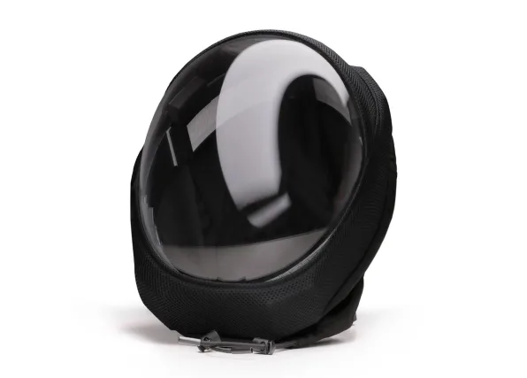
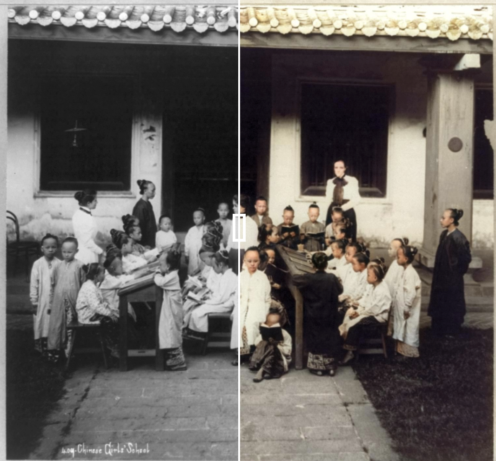
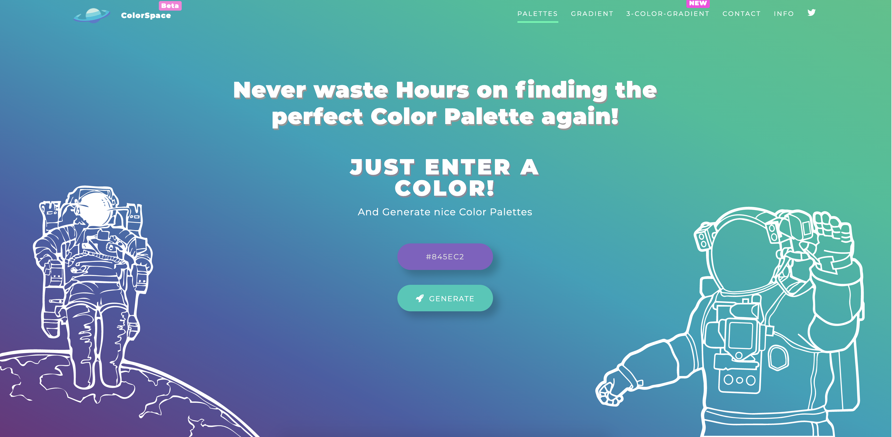
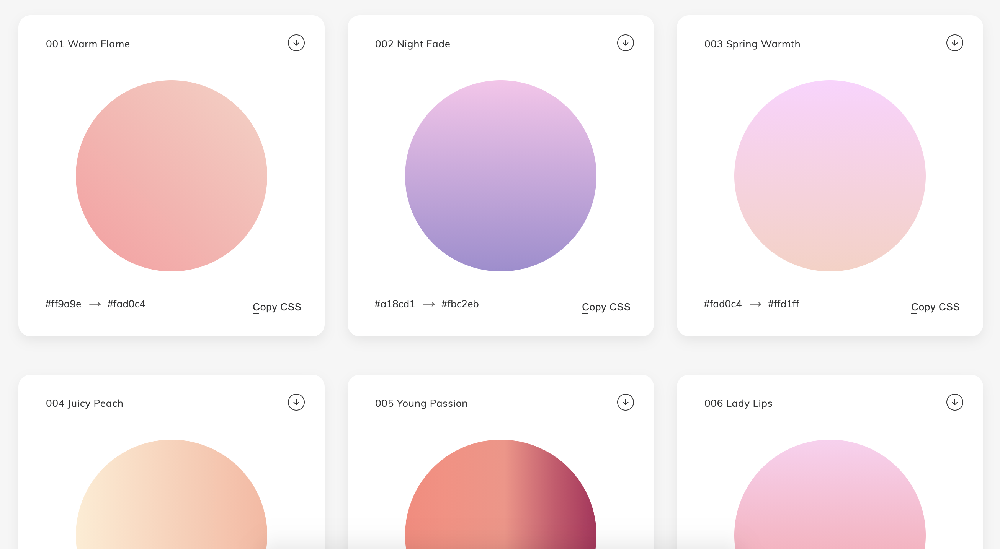
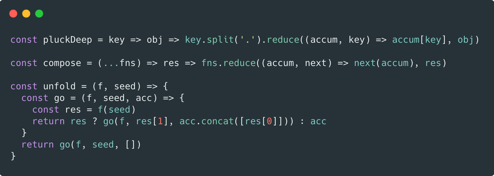
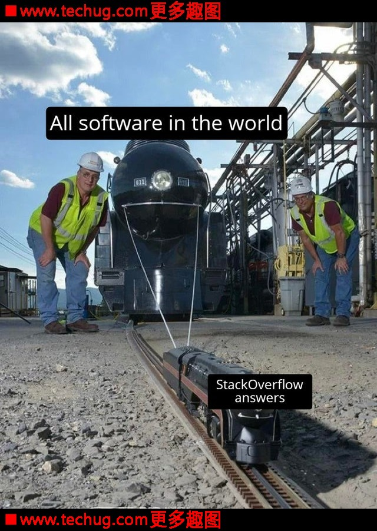

# 创意周刊：第 32 期（20201009）

[创意周刊](https://www.yuque.com/u86464/weekly)是基于每周阅读的新闻、时事、图片和技术等内容的综合分享平台，同步更新于 GitHub [logeast/weekly](https://github.com/logeast/weekly)。

## 封面图


[左]星期一（2015）; [右]MISSING THE BLUE SKY, 2019

Calleja 的练习以睁大眼睛、大头的人物而备受国际喜爱。

## 新闻

### 1. 霍尔实验室发布了一款[可替代滑雪面具的可穿戴头盔](https://www.fastcompany.com/90559694/hate-masks-try-this-space-age-helmet-instead)。

头盔看起来像是宇航员在太空中戴的，可清洗的黑色织物将头盔紧紧地固定在脖子上，并附着在一个清晰的丙烯酸半圆顶上，从头部后面到下巴下方的面部弯曲。内置了一个通风系统，可防止起雾，并能过滤 99.97% 的小于 0.03 微米的小颗粒，效果等同于 N-95 口罩。头盔重约两磅。




## 教程

### 1. [CSS Border-Radius Can Do That?](https://medium.com/9elements/css-border-radius-can-do-that-d46df1d013ae)

讲述 CSS border-radius 属性的基本用法及一些酷炫的效果。


### 2. [Accessibility in JavaScript Applications](https://frontendmasters.com/courses/javascript-accessibility/?utm_source=css-tricks&utm_medium=website&utm_campaign=css-tricks-tags-sidebar)

一套消除可能阻止残障人士使用现代 JavaScript Web 应用程序的访问障碍的课程。研究了 UI 组件中的可访问性，技术栈是 React 和 Gatsby.js，但知识适用于所有 JavaScript Web 应用。

### 3. [Advanced Bash-Scripting Guide](https://tldp.org/LDP/abs/html/index.html)

深入探索 Shell 脚本的艺术，挺久之前的教程了，枚举了很多示例，适合初学者向高级工程师进阶。

### 4. [Building Skeleton Screens with CSS Custom Properties](https://css-tricks.com/building-skeleton-screens-css-custom-properties/)

使用 CSS 自定义属性构建骨架屏幕。

## 资源

### 1. [在线短信接收](https://www.materialtools.com/)

有时候我们需要用手机号码临时注册一些网站，却又不想后续使用，则可以临时用下这里的号码。以下是他的服务条款。

- 在使用前你应该知晓下面的电话号码短信内容所有人都可以查看
- 请不要用这个电话号码接收重要内容
- 下面的电话号码只用于注册一些网站，防止被骚扰
- 他人可以通过此电话号码找回密码，所以注册时应注意个人信息
- 严禁用作非法用途，所产生的法律后果由使用者自行承担
- 由此造成经济损失概不负责
- 在使用时即代表以上条款已同意

### 2. [为黑白照片着色](https://colourise.sg/)

基于深度学习的在线工具，将黑白照片转化成彩色的。



中国女子学校，新加坡，1890年至1923年。弗兰克和弗朗西斯卡彭特收藏，美国国会图书馆。

### 3. 一款[颜色自动生成器](https://mycolor.space/)

输入一个颜色，就会自动生成一系列对应的颜色，再也不要浪费时间去寻找完美的调色板！
此外，还可以生成[两种](https://mycolor.space/gradient)或者[三种](https://mycolor.space/gradient3)颜色的 CSS 渐变色。



### 4. [WebGradients 线性渐变](https://webgradients.com/)

是一个180个线性渐变的免费集合，可以将其用作网站任何部分的内容背景。也可以复制 CSS3 代码，提供 Sketch 和 Photoshop 包可以下载。



### 5. [Hacker News API](https://hn.algolia.com/api)

使开发人员能够使用 REST API 以编程方式访问 HN 数据。

```javascript
1. 列表
【GET】http://hn.algolia.com/api/v1/items/:id

2. 用户
【GET】http://hn.algolia.com/api/v1/users/:username

3. 搜索
【GET】http://hn.algolia.com/api/v1/search?query=...
【GET】http://hn.algolia.com/api/v1/search_by_date?query=...
```
### 6. [The Bezier Game](https://bezier.method.ac/)

一款帮助掌握 PS 钢笔工具的小游戏。

### 7. [Muzli 设计资源搜索引擎](https://search.muz.li/)

一个设计资源搜索引擎，可以根据颜色搜索。可以用来寻找配色，查找图片，查看别人的设计作品等。


### 8. [DIYgod/RSSHub](https://github.com/DIYgod/RSSHub)

RSSHub 是一个开源、简单易用、易于扩展的 RSS 生成器，可以给任何奇奇怪怪的内容生成 RSS 订阅源。RSSHub 借助于开源社区的力量快速发展中，目前已适配数百家网站的上千项内容。

### 9. [with code](https://withcode.cmiscm.com/#metaballs) 提供了一系列有趣的鼠标交互动画来吸引你

[]()

### 10. [carbon 代码转图片工具](https://carbon.now.sh/)

输入代码即可转换为漂亮的图片，支持自定义配置属性，下面这张图片就是转换过来的。



### 11. [顶级域名列表](http://data.iana.org/TLD/tlds-alpha-by-domain.txt)

互联网号码分配局（IANA）官方的目前所有顶级域名（TLD）的列表，共有1508个。如果排除国家和地区的 TLD，则为1260个。
资源来自于 [Lenix Blog 顶级域名列表](https://blog.p2hp.com/)。

### 12. [2℃ Earth](https://www.2-c.earth/information)

2℃ Earth 是一个视觉指南，探索海安古镇、瓦迪拉姆、开普花卉区、加拉帕戈斯和澳大利亚大堡礁五个在世界各地地点的自然和文化遗产受到气候变化的威胁。


## 图片

### 1. [即刻地球](https://eoikoe.com/monitore)

每隔十分钟左右，会抓取一张向日葵8号卫星所拍摄到的地球照片。然后进行美化处理，渲染出一张适合用作壁纸的图片。根据时间和太阳照射角度的不同，即刻地球会对原始照片进行艺术化处理，使其更适合用作桌面。


### 2. [向日葵 8 号即时网页](https://himawari8.nict.go.jp/)

向日葵8号（日语：ひまわり8号）是日本气象卫星之一，属于地球同步卫星。其作用为提供日本、东亚及西太平洋之周边的天气预报、台风、暴雨、气候变化的观察、预测等相关之报告，同时负责确保船只与航空的安全以及观察地球之环境。


向日葵 8 号亚洲-大洋洲地区的影片（含海岸线）

### 3. [StackOverflow 在编程界中的重要性](https://www.techug.com/post/stackoverflows-importance-in-the-programming-world.html)

程序员漫画：StackOverflow 在编程界中的重要性。


