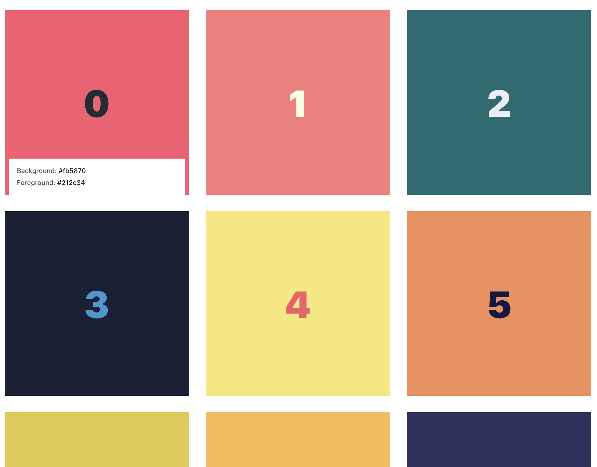

# 创意周刊：第 33 期（20201016）

[创意周刊](https://www.yuque.com/u86464/weekly)是基于每周阅读的新闻、时事、图片和技术等内容的综合分享平台，同步更新于 GitHub [logeast/weekly](https://github.com/logeast/weekly)。

## 封面图

[CodePen](https://codepen.io/shunyadezain/pen/mdEJjJR) 上 Shunya 用 CSS 实现的磁悬浮球，点链接进去可以看到动图。用到的技术有 CSS gradient/shadow/animation。

## 新闻
### 1. [火星将距离地球最近](https://blogs.nasa.gov/Watch_the_Skies/2020/10/09/its-all-about-mars-in-october/?utm_source=TWITTER&utm_medium=NASA&utm_campaign=NASASocial&linkId=101703654)

今年 10 月，火星将处于最亮状态，并一直持续到 11 月。通常月亮、金星和木星是地球夜晚前三亮的星星，但在这段时间里，火星的亮度将超越木星排行第三。在最远的位置，火星距离地球约 2.5 亿英里（4 亿公里），现在距离地球近 4000 万英里（6000 万公里）。

### 2. [疫情导致多艘豪华邮轮报废](https://www.kaiyanapp.com/new_article.html?nid=2190&shareable=true&rid=565&udid=a9c6f534ff964f57bc1687b5adc8aaa2133c76e2&vc=6030101&vn=6.3.10&size=1080X2217&deviceModel=Redmi+Note+7+Pro&first_channel=xiaomi&last_channel=xiaomi&system_version_code=29)

由于疫情重创了豪华邮轮海上旅行市场，土耳其莱拉船舶回收集团，接到了多艘需要报废解体的豪华邮轮。

## 教程

### 1. [Building a truly accessible clickable div](https://eng.wealthfront.com/2020/10/01/building-a-truly-accessible-clickable-div/)
一篇关于对 div 按钮添加可访问性点击的思考与实现。

### 2. [koi fish](https://codepen.io/alvaromontoro/pen/MWyReEq) 用 HTML 和 CSS 绘制的锦鲤

作者是 Alvaro Montoro 在日本，锦鲤象征着锦鲤象征着吉祥，繁荣和幸运。

### 3. [Braille Nenu](http://brailleneue.com/) 可通过触觉阅读的盲文

这是日本设计师和发明家高桥先生发明的盲文。早在 200 年前，盲文是被用做法国军队命令传输的密码，后来由盲人路易·布雷耶进一步完成了完整的盲文，但从零开始学习盲文的成本太高，实际用到的盲文占比也不是很高。目前，在公共场合，我们很少看到盲文，就是因为它需要额外的空间，需要比较高的成本。[Braille Nenu](http://brailleneue.com/) 是一种通用字体，将盲文与现有字符相结合，这种字体可以同时传达给视力正常着和视力障碍着，并且不占用额外的空间。

Braille Nenu 大纲：日语、拉丁文和罗马数字。

### 4. [从文档开始设计项目](https://uxdesign.cc/all-design-projects-should-start-in-a-google-doc-20ad24f75a8c)

一篇讲述设计项目的文章，首先从文档开始，然后再进入设计，有很多优势，因为在作者看来好的设计作品，一般是由不同的设计师、产品经理、销售和客户支持等人集思广益出来的。

1. 文档易于上手，可以共享，降低了入门壁垒；
1. 文档更容易拓展，想必绘制设计稿和代码实现，变化更容易；
1. 文档相比图片，更容易保持专注，而不是被特定的视觉对象或者特定的实现分心。

作者整理了一般文档需要包含的内容：文档通常包括以下部分：

- 背景和问题
- 目标和非目标
- 成功是什么样子的
- 研究
- 要求
- 设计理念
- 考虑的替代方案
- 事情怎么会出错
- 我们如何衡量结果
- 值得注意的讨论

### 5. [在新标签页中打开](https://www.nngroup.com/articles/new-browser-windows-and-tabs/?ref=sidebar)

[Opening Links in New Browser Windows and Tabs](https://www.nngroup.com/articles/new-browser-windows-and-tabs/?ref=sidebar)。在决定是否在同一或新的浏览器选项卡中打开文档和外部站点的链接时，需要仔细检查用户的上下文，手头的任务以及下一步。

## 资源

### 1. [mljs](https://github.com/mljs)/[ml](https://github.com/mljs/ml) 一款机器学习工具

一款用于 nodejs 和 JavaScript 的机器学习和数值分析工具。

### 2. [vasturiano](https://github.com/vasturiano)/[react-force-graph](https://github.com/vasturiano/react-force-graph) 一款用于 2D、3D、VR 和 AR 力导向图工具

一款用于 2D、3D、VR 和 AR 的基于 React 的力导向图工具。[力导向绘图 (Force-directed graph drawing)](https://en.wikipedia.org/wiki/Force-directed_graph_drawing)可以用于描述关系图的结点之间的关系，把结点分布到画布上合理的位置，比如描述企业之间的关系，社交网络中的人际关系等。

### 3. [pcottle](https://github.com/pcottle)/[learnGitBranching](https://github.com/pcottle/learnGitBranching) 可视化学习 git 的工具
一款帮助开发人员通过可视化功能理解 git 的小游戏。

### 4. [Duo](https://duo.alexpate.uk/?ref=designresourc.es) 颜色组合网站

设计师 Alex Pate 从个人项目或者网上遇到的各种颜色组合的集合。

### 5. [Web 内容辅助功能指南 （WCAG） 概述](https://www.w3.org/WAI/standards-guidelines/wcag/)

W3C 使残疾人能够访问网络的战略、标准和资源。介绍 Web 内容辅助功能指南 （WCAG），包括 WCAG 2.0 和 WCAG 2.1。Web 内容可访问性指南 （WCAG） 通过 [W3C](https://www.w3.org/WAI/standards-guidelines/w3c-process/) 流程与世界各地的个人和组织合作制定，目的是为 Web 内容可访问性提供单一共享标准，满足国际上个人、组织和政府的需求。WCAG 文档解释了如何让残障人士更容易访问 Web 内容。Web 内容通常指网页或 Web 应用程序中的信息，包括：

- 自然信息，如文本、图像和声音。
- 定义结构、表示等的代码或标记。

### 6. [Piskel](https://www.piskelapp.com/) 像素艺术编辑器

一款用 JavaScript 实现的免费动画和像素艺术的在线编辑器，可以生成 GIF 图片。GitHub 地址为 [piskelapp](https://github.com/piskelapp)/[piskel](https://github.com/piskelapp/piskel)。

### 7. [GORM](https://gorm.io/) Golong 的 ORM 库

ORM 就是通过实例对象的语法，完成关系型数据库的操作的技术，是"对象-关系映射"（Object/Relational Mapping） 的缩写。

### 8. [filters.css](https://bansal.io/filters-css) CSS 滤镜库

仅用 CSS 实现的滤镜库。

### 9. [bansal-io](https://github.com/bansal-io)/[pattern.css](https://github.com/bansal-io/pattern.css) CSS 背景库

用美丽的图案填充空的背景。

## 图片

### 1. Sysloop 自主建筑管理系统

在布拉格市特洛伊区一座山坡上的索菲亚别墅(Villa Sophia)没有钥匙，没有电灯开关，但有一架可以自动演奏的钢琴。下雨的时候，房子可以自动关窗，并根据房主的兴趣朗诵它从互联网上选择的材料。这幢面积达 5100 平方英尺的房屋呈螺旋形，有一览无余的景观，由人工智能控制。人工智能取代了现有系统中需要人类干预的部分，从而接管控制。通过位于地板中、抽屉里、厨房桌下的传感器来收集数据。

