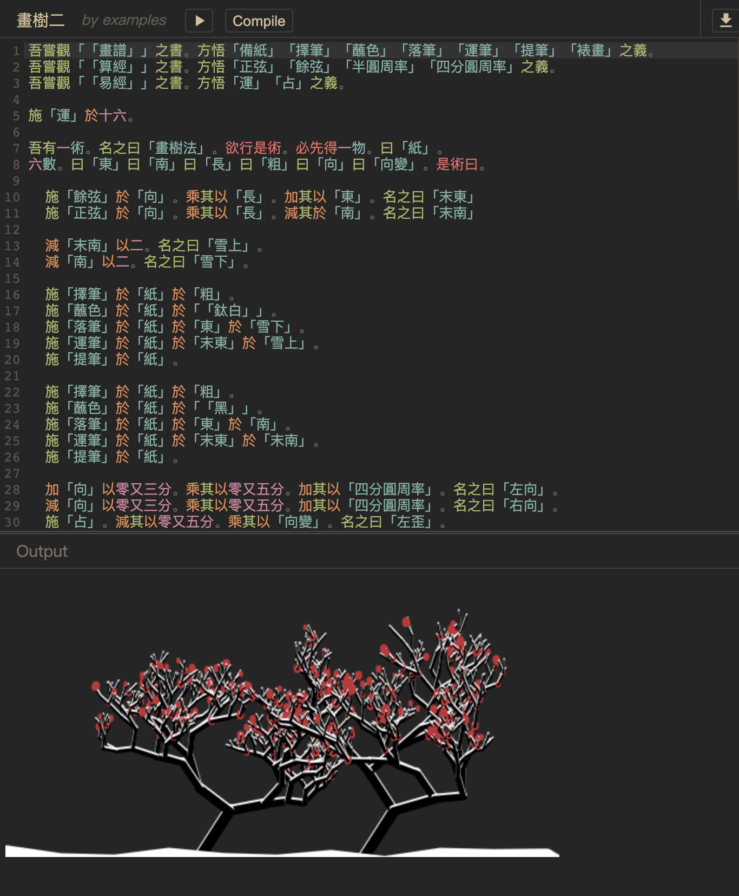
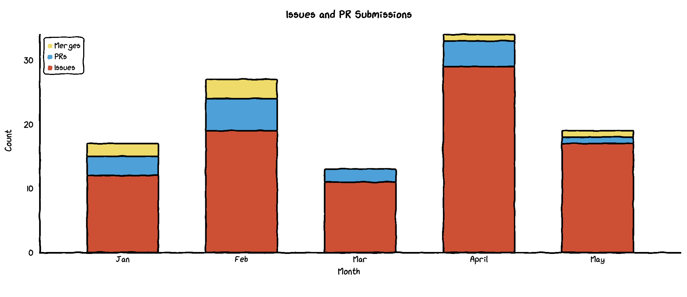
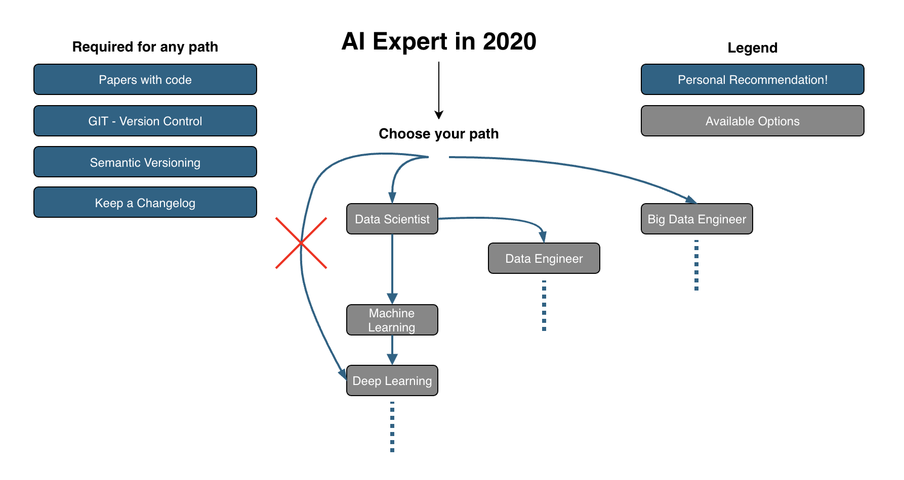
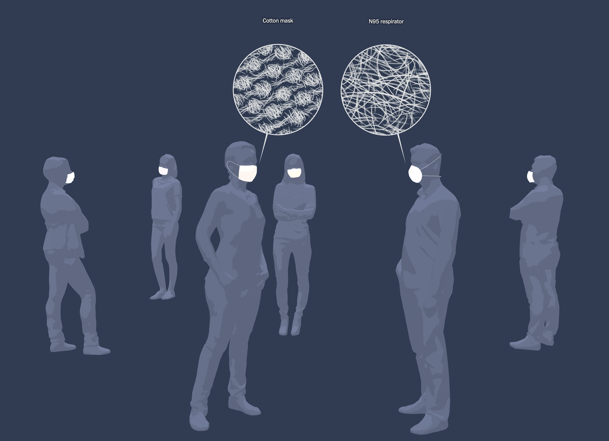

# 创意周刊：第 34 期（20201106）

[创意周刊](https://www.yuque.com/u86464/weekly)是基于每周阅读的新闻、时事、图片和技术等内容的综合分享平台，同步更新于 GitHub [logeast/weekly](https://github.com/logeast/weekly)。

## 封面图


[国际空间站](https://artsandculture.google.com/story/getting-to-know-the-iss/ogLSu_VAfa6FJQ)。

## 新闻

### 1. [Getting to Know the ISS](https://artsandculture.google.com/story/getting-to-know-the-iss/ogLSu_VAfa6FJQ) 认识空间站

国际空间站已经存在 20 周年了，这篇文章讲述了关于这个高空国际实验室的 20 个最常被问到的问题。
下面我列举了其中的部分问题及答案。

-   空间站在太空有多久了?

    > 自 2000 年 11 月以来，空间站一直有宇航员驻留。然而，空间站的第一个模块“曙光号”于 1998 年 11 月发射升空。

-   空间站有多大?

    > 空间站有一个美式足球场那么大，它的重量将近一百万磅。

-   空间站有多高?

    > 空间站在地球上空大约 250 英里的高度飞行。

-   空间站移动的速度有多快?

    > 空间站的飞行速度为每小时 17500 英里(约每秒 5 英里)。它大约每 90 分钟绕地球一周。这意味着太阳一天会升起和落下 16 次。

-   到空间站需要多长时间?

    > 搭乘俄罗斯联盟号飞船从哈萨克斯坦拜科努尔发射场飞往国际空间站需要 6 到 48 小时，具体时间取决于发射程序和空间站在轨道上的位置。

-   宇航员在空间站待多久?

    > 一个典型的任务大约是六个月。然而，随着 NASA 未来的长时间飞行任务，一些宇航员已经在太空停留了长达 340 天，以观察在太空长时间停留期间微重力对人体的影响。

-   在国际空间站生活时，你的身体是如何变化的?

    > 一进入零重力状态，你腿部和身体下部的液体就会向上流向头部，使你的脸看起来肿胀。一些宇航员在适应零重力的时候会感到头晕和胃不舒服，但这种感觉通常几天后就会消失。宇航员还必须每天锻炼两小时以保持身体健康，保持骨骼和肌肉强壮。

-   宇航员在国际空间站吃什么?

    > 宇航员可以从许多种类的食物中选择，如水果、坚果、花生酱、鸡肉、牛肉、海鲜、糖果、布朗尼蛋糕等。烹饪方法因食物种类而异。由于空间站上没有炉子或微波炉，大多数食物已经煮熟，然后冷冻干燥，真空包装，或者是热稳定，很像露营的食物。这些冷冻干燥的食品包装可以通过加水重新组合，然后在一个小型加热烤箱中加热。营养学家确保宇航员吃的食物为他们提供平衡的维生素和矿物质供应。美国和大多数将宇航员送到国际空间站生活的国家已经准备好了食物。

-   宇航员在空间站做什么工作?

    > 空间站上的宇航员和宇航员忙于操作空间站上的许多科学实验。宇航员必须确保空间站处于最佳状态，所以他们要清洁、检查设备，并维护、修理或更换损坏的设备。有时宇航员需要进行太空行走来做空间站外部的维护工作。这些舱外活动(简称 EVAs)有助于维持空间站的运转。

-   宇航员是怎么洗衣服的?

    > 空间站上没有洗衣机，所以宇航员必须穿好几天才能换衣服。运动装备每周换一次，内衣每隔几天换一次，而衬衫和裤子可以穿好几个星期。

-   宇航员能在国际空间站给家人打电话吗?
    > 直到几年前，宇航员还不能很容易地与地面上任务控制中心以外的人交流。现在，他们可以直接向朋友和家人发送电子邮件，还可以通过电脑连接打电话。

### 2. [Remote In Tech](https://remoteintech.company/)

从半远程友好型到完全远程友好型的科技公司名单。

### 3. [新西兰通过安乐死法案](https://www.kaiyanapp.com/new_article.html?nid=2301&shareable=true&rid=666&udid=a9c6f534ff964f57bc1687b5adc8aaa2133c76e2&vc=6030101&vn=6.3.10&size=1080X2217&deviceModel=Redmi+Note+7+Pro&first_channel=xiaomi&last_channel=xiaomi&system_version_code=29)

新西兰公布了「安乐死法案」全民公投的结果，这个法案获得了 65.2% 的支持率，将在 2021 年 11 月开始正式生效。「安乐死法案」适用于患有绝症，并且可能在 6 个月内死亡而难以忍受痛苦的成年人，实施的前提是得到两位医生的批准。这意味着，新西兰公民有了「选择死亡」的权利。除了新西兰外，荷兰、卢森堡、加拿大、比利时和哥伦比亚的安乐死也是合法的。

## 教程

### 1. [在浏览器中运行 npm 包](https://hackernoon.com/how-we-make-npm-packages-work-in-the-browser-announcing-the-new-packager-6ce16aa4cee6)

[How we make npm packages work in the browser; announcing the new packager](https://hackernoon.com/how-we-make-npm-packages-work-in-the-browser-announcing-the-new-packager-6ce16aa4cee6)

中文译文：[CodeSandbox 是如何让 npm 上的模块直接在浏览器端运行的](https://mp.weixin.qq.com/s/qQd-4cOEOUokhzt6nSUw8A)

### 2. [Native CSS Masonry Layout In CSS Grid](https://www.smashingmagazine.com/native-css-masonry-layout-css-grid/?ref=sidebar)

原生 CSS Gird 布局实现瀑布流效果，核心代码就下面几行。

```css
.container {
    display: grid;
    grid-template-columns: repeat(4, 1fr);
    grid-template-rows: masonry;
}
```

## 资源

### 1. [leachim6](https://github.com/leachim6)/[hello-world](https://github.com/leachim6/hello-world) 计算机语言的 Hello World

记录了 694 种计算机语言的 Hello World 的写法。

### 2. [wenyan-lang](https://github.com/wenyan-lang)/[wenyan](https://github.com/wenyan-lang/wenyan) 用文言文写代码

文言文编程语言。符合[古汉语](https://en.wikipedia.org/wiki/Classical_Chinese)语法的自然语言处理程序，可以编译成 JavaScript，Python，或者 Ruby。还提供[在线 IDE](http://wenyan-lang.lingdong.works/ide.html) 用于体验。



### 3. [CHART.XKCD](https://timqian.com/chart.xkcd/) 一个卡通和手绘样式的图表库



### 4. [i.am.ai](https://i.am.ai/roadmap/#note) 人工智能专家路线图

这是一家德国软件公司 AMAI GmbH 近期发布的 GitHub 项目——AI 专家路线图（AI-Expert-Roadmap）。该路线图几乎涵盖了 AI 领域所有的知识点，并且每个知识点都有详细的文档。有了这个路线图的指导，或许能帮助你快速入门乃至成为 AI 领域的佼佼者。每个子模块所列内容都可以链接到指定网站，学习者可以找到词条的维基百科或其他来源的释义和拓展内容。

[不要上手就学深度学习！超详细的人工智能专家路线图](https://mp.weixin.qq.com/s/ZATEstWc2Vzbyx1yR7UdrQ)


### 5. [PaddlePaddle](https://github.com/PaddlePaddle)/[PaddleOCR](https://github.com/PaddlePaddle/PaddleOCR) 百度开源的 OCR 识别工具库

PaddleOCR 旨在打造一套丰富、领先、且实用的 OCR 工具库，助力使用者训练出更好的模型，并应用落地。

## 图片

### 1. [极简壁纸](http://simpledesktops.com/browse/)

极简风格，支持 Mac、iOS、安卓客户端。


[Big_Sur_Simple](http://static.simpledesktops.com/uploads/desktops/2020/06/28/Big_Sur_Simple.png)


[mountains-on-mars](http://static.simpledesktops.com/uploads/desktops/2015/03/02/mountains-on-mars.png)

### 2. [口罩是怎么工作的](https://www.nytimes.com/interactive/2020/10/30/science/wear-mask-covid-particles-ul.html?ref=sidebar)

随着页面的滚动，展示了口罩的工作原理。
口罩有多种样式和材料，但是它们通常以相同的方式工作，一般通过纤维层来捕获较大的呼吸飞沫和较小的空气传播颗粒，称为气溶胶，这种颗粒可以携带着冠状病毒。



### 3. [墨西哥亡灵节:「庆祝」逝者的离去的日子](https://www.magnumphotos.com/arts-culture/society-arts-culture/day-of-the-dead/) [开眼精选翻译](https://www.kaiyanapp.com/new_article.html?nid=2305&shareable=true&rid=670&udid=a9c6f534ff964f57bc1687b5adc8aaa2133c76e2&vc=6030101&vn=6.3.10&size=1080X2217&deviceModel=Redmi+Note+7+Pro&first_channel=xiaomi&last_channel=xiaomi&system_version_code=29)

死亡是生命的自然组成部分。还记得「寻梦环游记」这部电影中的亡灵节吗？为了记录下这珍贵的文化遗产，玛格南摄影师们拿起了手中的相机，拍摄了墨西哥亡灵节的情景。


## 言论

### 1. [@brandonthezhang](https://softwareleadweekly.us6.list-manage.com/track/click?u=1a258e0fefbb23214c59c5a8d&id=07ea0b88e9&e=332337bda0): Diversify the books you read. Centralize the books you read repeatedly.

多样化你阅读的书籍，但集中你反复阅读的书籍。
