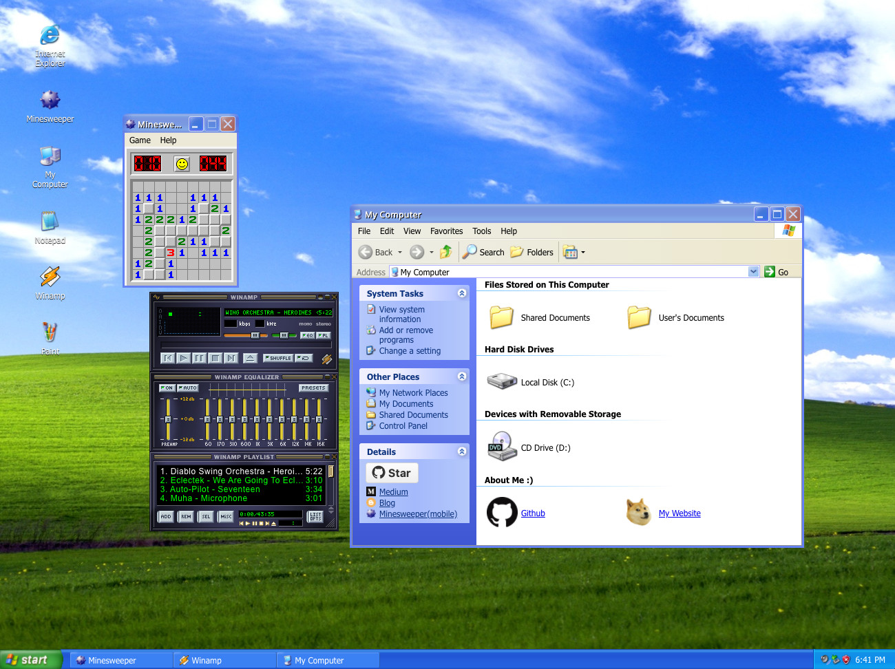

# 创意周刊：第 35 期（20201130）

[创意周刊](https://www.yuque.com/u86464/weekly)是基于每周阅读的新闻、时事、图片和技术等内容的综合分享平台，同步更新于 GitHub [logeast/weekly](https://github.com/logeast/weekly)。

## 封面图

《芝麻开门》杂志第二期：孤单

## 教程

### 1. [富文本编辑器的技术演进 罗龙浩](https://myslide.cn/slides/21863?spm=a2c6h.12873639.0.0.617f74647LjCnx#)

蚂蚁金服高级前端技术专家，语雀文档编辑器负责人罗龙浩讲述了语雀编辑器的演进之路。

### 2. [“云”端的语雀：用 JavaScript 全栈打造商业级应用](https://developer.aliyun.com/article/742595)

介绍了语雀近年来经过架构的不断演进，到目前的商业化阶段，是如何通过 JavaScript 全栈进行研发使得产品逐年发展，技术逐年演进的。

### 3. [1-Line Layouts](http://1linelayouts.glitch.me/)

10 个现代 CSS 布局和大小调整技术。

## 资源

### 1. [微软人工智能工具 Lobe](https://lobe.ai/)

通过免费，易于使用的工具帮助您训练机器学习模型。不用写代码即可以完成训练，必然是是机器学习未来发展的方向。

### 2. [React 版本的 winXP](https://winxp.now.sh)

GitHub 地址：[ShizukuIchi](https://github.com/ShizukuIchi)/[winXP](https://github.com/ShizukuIchi/winXP)。支持拖动和调整大小，最小化，最大化窗口，内置了扫雷游戏，Internet Explorer，我的电脑，记事本，Winamp（一款音乐播放器） 等工具。

### 3. [tsayen](https://github.com/tsayen)/[dom-to-image](https://github.com/tsayen/dom-to-image)

使用 HTML5 canvas 从 DOM 节点生成图像。

### 4. [egg-swagger-doc](https://www.npmjs.com/package/egg-swagger-doc)

应用于 eggjs 的 plugin,可自动生成 SwaggerUI。应用启动后访问 /swaagger-ui.html 可 以浏览页面，访问 /swagger-doc 获取 swagger.json. 这是[一个简单例子](https://github.com/Yanshijie-EL/egg-example-api)。

### 5. [Monaco Editor](https://github.com/Microsoft/monaco-editor) vscode 的底层编辑器

Monaco Editor 是为 VS Code 提供支持的代码编辑器。支持主题设置、自动补全和代码对比等核心功能。

### 6. [fish-shell](https://github.com/fish-shell)/[fish-shell](https://github.com/fish-shell/fish-shell) 一个命令行 shell

用户友好的命令行 shell。

### 7. [casesandberg](https://github.com/casesandberg)/[react-color](https://github.com/casesandberg/react-color) 基于 React 的颜色选择器

类似 Sketch，Photoshop，Chrome，Github，Twitter，Material Design 等的颜色选择器集合。

## 图片

### 1. [这个俄罗斯女孩为淘宝出了一本独立杂志](https://www.voicer.me/archives/102207)

有一个俄罗斯 Sasha 女孩深深地沉迷于淘宝，她专门为淘宝办了一份名为《芝麻开门》的杂志是一本关于淘宝的独立杂志。
目前《芝麻开门》出了两期，第一期有关“真假”，第二期有关“孤单”。第二期有淘宝相亲、淘宝心理咨询、淘宝美学等主题。

《芝麻开门》杂志第一期：The Real Thing

《芝麻开门》杂志第二期：孤单

### 2. [人人羡慕的自由职业，真有那么自由吗？](https://www.voicer.me/archives/102050)

走走停停，再走走，绝对的自由悬而未决，听从心的感受，往前即可。

We work for fun only. 只为快乐而工作。

We travel, we stay, we travel again. 我们旅行，我们停留，我们再次向前。

Don't listen to them. Listen to music. 别听他们的，去听音乐。
