# 创意周刊：第 36 期（20201211）

[创意周刊](https://www.yuque.com/u86464/weekly)是基于每周阅读的新闻、时事、图片和技术等内容的综合分享平台，同步更新于 [GitHub](https://github.com/logeast/weekly) 和 [Gitee](https://gitee.com/logeast/weekly) 的 [logeast/weekly](https://github.com/logeast/weekly)。

## 封面图

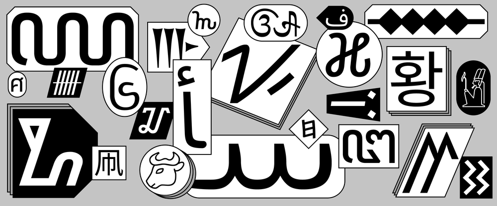
Google 开源的 [Google Noto Fonts](https://www.google.com/get/noto/)。

## 教程

### 1. [如何构建和部署一个有趣的无服务器机器学习应用程序](https://towardsdatascience.com/building-and-deploying-cartoonify-b4786b382d7e)

一篇讲述利用机器学习方法将照片转换成卡通的教程。

### 2. [鼠标 hover 悬停的奇思妙想](https://www.joshwcomeau.com/react/boop/)

利用 React 加 CSS transition 做一些好玩的图标微动效。
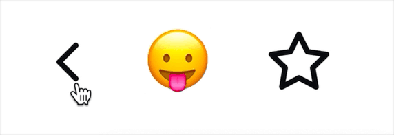

### 3. [中文字体科普](https://www.bilibili.com/video/BV1Xa411w7HU)

B 站主播 oooooohmygosh 和 3type 字体工作室合作，用六分钟的简单动画和旁白讲述中文字体设计的基础知识。
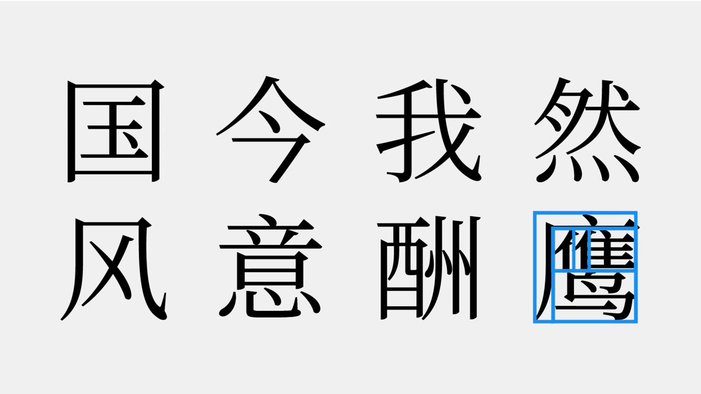

### 4. CSS Grid 的便利：[3 行代码实现日历排版](https://calendartricks.com/a-calendar-in-three-lines-of-css/)

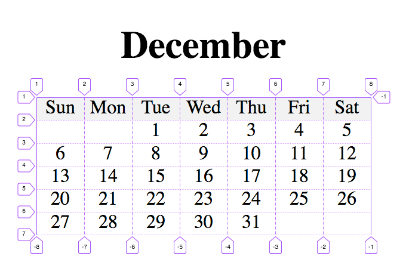
想要实现上面的排版，核心 CSS 代码只需要 3 行。

```css
.calender {
    display: grid;
    grid-template-columns: repeat(7, 1fr);
}
.first-day {
    grid-column-start: 3;
}
```

下面是对应的 html 部分。

```html
<div class="calendar-wrapper">
    <h1>Decemeber</h1>
    <ul class="calendar">
        <li class="weekday">Sun</li>
        <li class="weekday">Mon</li>
        <li class="weekday">Tue</li>
        <li class="weekday">Wed</li>
        <li class="weekday">Thu</li>
        <li class="weekday">Fri</li>
        <li class="weekday">Sat</li>

        <li class="first-day">1</li>
        <li>2</li>
        <li>3</li>
        <!-- ... -->
        <li>29</li>
        <li>30</li>
        <li>31</li>
    </ul>
</div>
```

## 资源

### 1. [pmndrs](https://github.com/pmndrs)/[react-spring](https://github.com/pmndrs/react-spring) 基于弹性物理的 React 动画库

React Spring 是一个基于弹性物理的动画库，有很强大功能的 API。
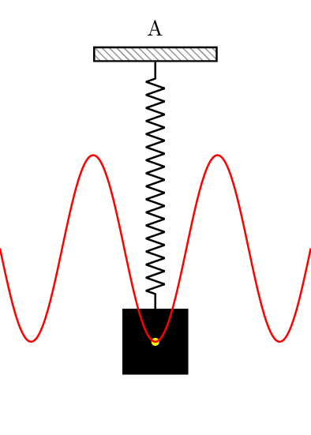

这里有一份[可打印的 PDF 文件]()，包括一些常用的代码片段，以及一些 spring 动画信息。

### 2. [catdad](https://github.com/catdad)/[canvas-confetti](https://github.com/catdad/canvas-confetti) 在页面上撒五彩纸屑

用 canvas 实现的动画库，可以在页面上撒彩色纸屑。


### 3. [skypack](https://www.skypack.dev/) 不安装 npm 包即可在浏览器中使用的 CDN 服务

Skypack 是专为现代 JavaScript 应用程序设计和优化的世界上一个 CDN 服务。要使用它，只需引入 Skypack URL 即可，比如引入 React 可以用下面的方式。

```javascript
import React from 'https://cdn.skypack.dev/react';
```

### 4. [Dev Fonts](https://devfonts.gafi.dev/) 适合代码开发的字体预览

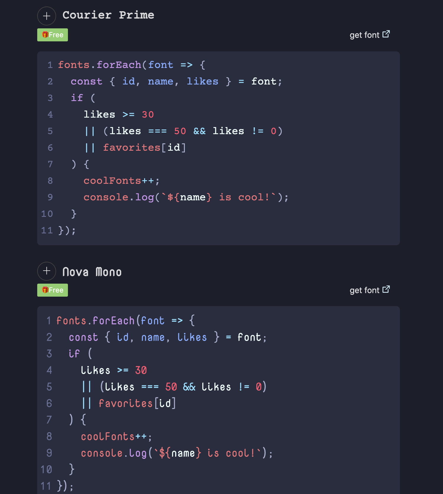

## 图片

### 1. [用 Noto 字体保存濒危语言](https://blog.google/outreach-initiatives/accessibility/preserving-endangered-languages-noto-fonts/?ref=sidebar/1/01000175feacd1cf-8327dd43-4b40-42e5-82f0-be5f2873141e-000000/EuHD5WOVwflc5WMuIJeY_l2FExs=189)

据联合国教科文组织统计，全世界 6000 种语言中，至少有 43% 处于濒危状态。
有时计算机上字符显示为“豆腐块（𛲢𛲡𛲠）”，这些小框表示设备没有合适的字体来显示文本。Google 开源的
[Google Noto Fonts](https://www.google.com/get/noto/) 为 146 种脚本（书写系统）和 800 多种语言提供字体，允许所有人免费使用，完整的 Noto 字体包有 1.1GB。Noto 这个名字是为了传达谷歌“no more tofu”的理念，意思是不要再有更多的豆腐块。


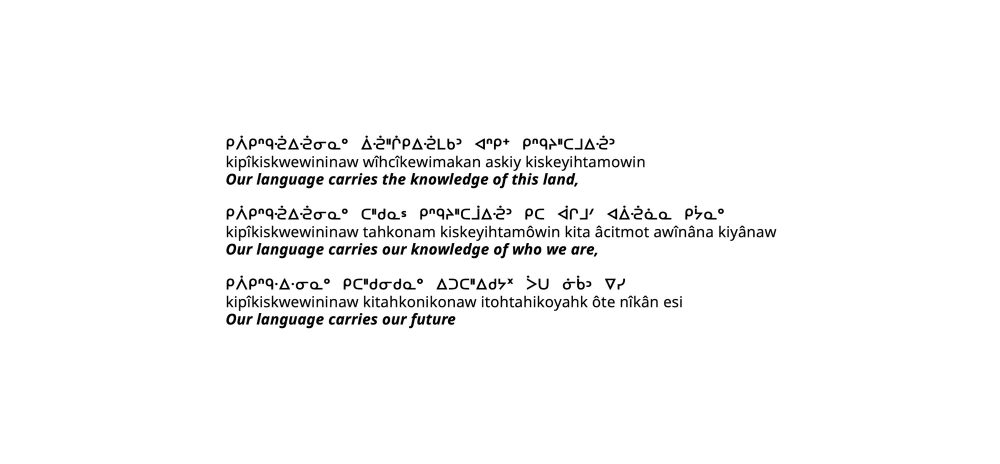

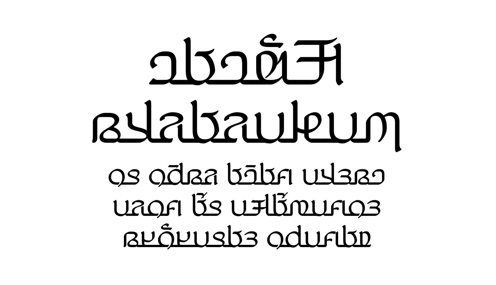


### 2. [第一批 50 个 Figma 插件开发人员签名](https://rsms.me/work/figma/s-plugins-launch-poster.p3.jpg)

这篇文章[介绍了 Figma](https://rsms.me/work/figma/) 团队开发 Figma 的桌面端、构建 Figma 的设计文化的过程。
Figma 团队围绕"积木"开发了一个概念，通过使用方和圆等基本图形形状，将 Lego 或 Meccano 的碎片组合在一起，将 Figma 与图形设计的基础连接到一起设计出现在的 logo。
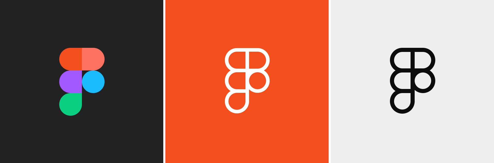
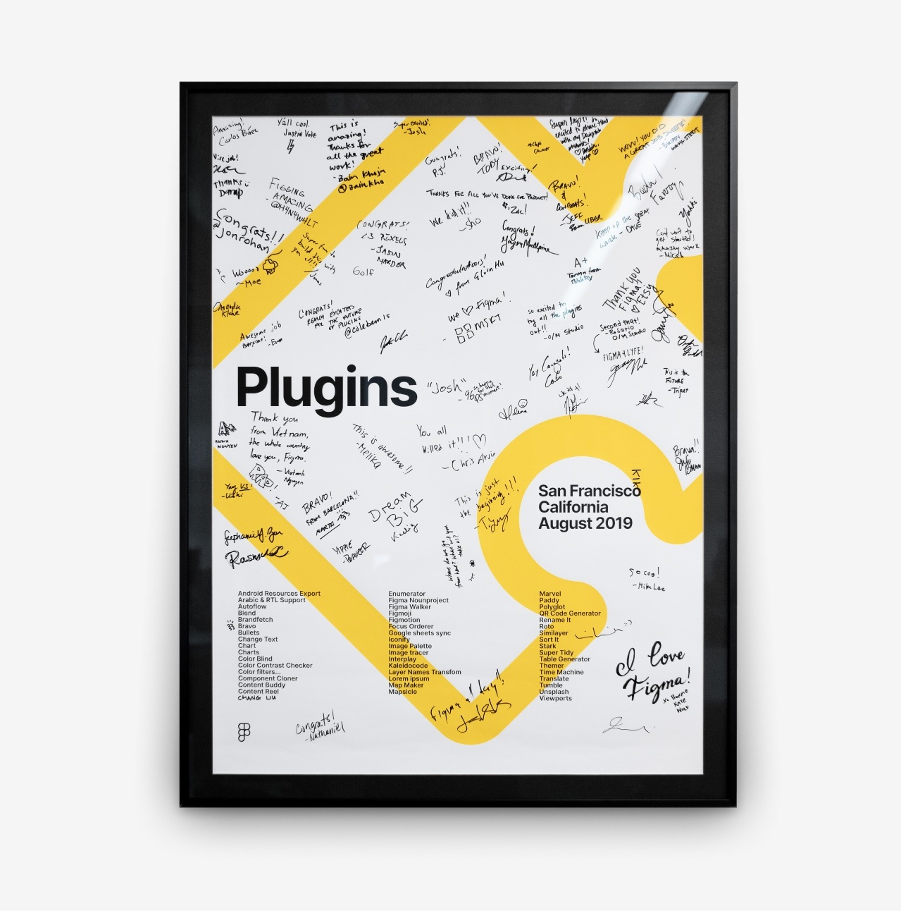

### 3. [品牌的力量—— 极简 Logos](https://www.behance.net/gallery/29836035/Power-of-Brands-Minimal-Logos)

葡萄牙平面设计师佩德罗·阿尔梅达（Pedro Almeida）发布了一个名为 “品牌的力量—— 极简 Logos ” 的个人设计，将著名品牌的 logo 进行简化设计，看人们是否能认出这些简化后的 logo。惊讶地发现，即使 logo 模糊了形状、轮廓线条和细节，依然能一眼认出它们。

这些 logo 依次是以下品牌的简化版。

| Twitter    | MasterCard | BMW        | Ebay                |
| ---------- | ---------- | ---------- | ------------------- |
| FedEx      | Amazon     | Youtube    | Continental - tyres |
| Instagram  | Playboy    | Volvo      | Google              |
| Vodafone   | Shell      | McDonald's | Ikea                |
| Land Rover | Apple      | Samsung    | Pizza Hut           |

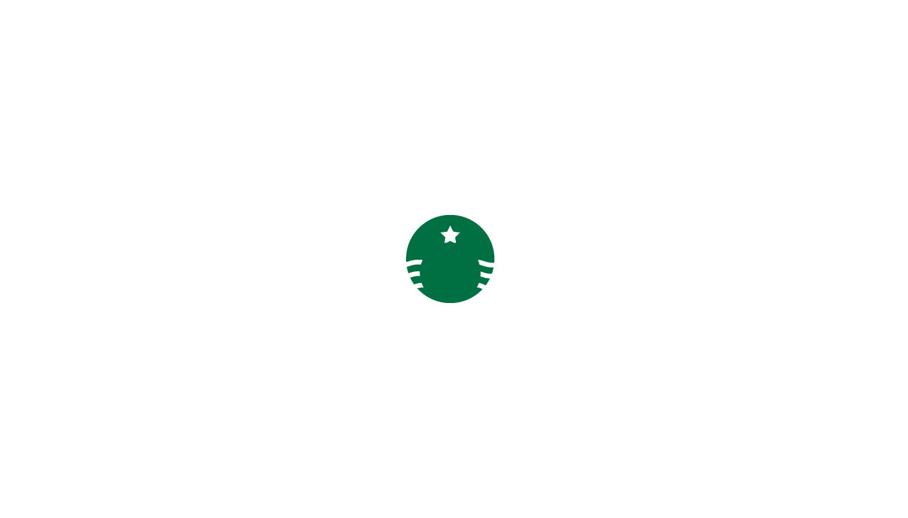
Starbucks

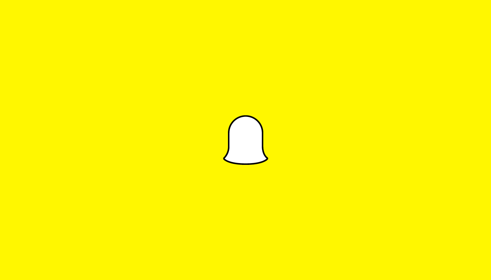
Snapchat
