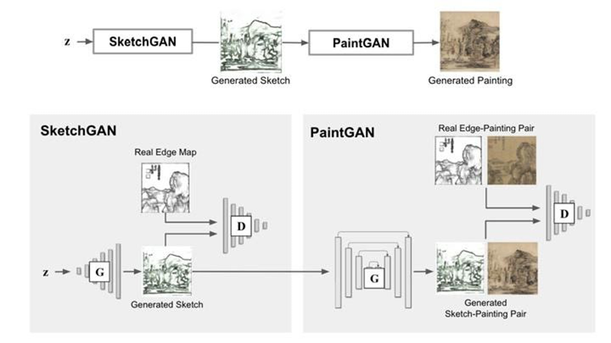
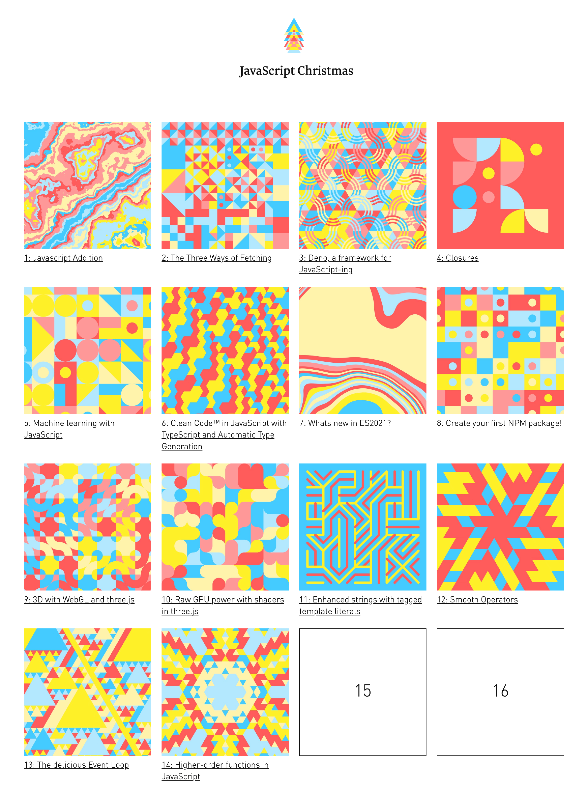
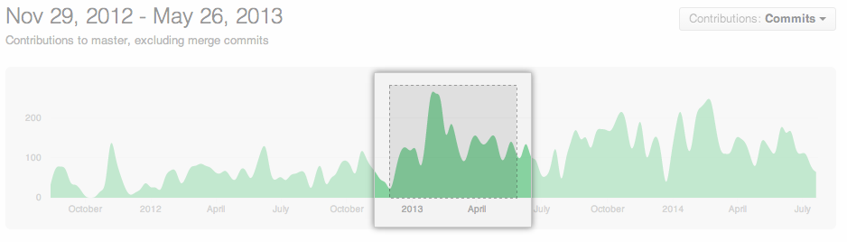

# 创意周刊：第 37 期（20201225）

[创意周刊](https://www.yuque.com/u86464/weekly)是基于每周阅读的新闻、时事、图片和技术等内容的综合分享平台，同步更新于 [GitHub](https://github.com/logeast/weekly) 和 [Gitee](https://gitee.com/logeast/weekly) 的 [logeast/weekly](https://github.com/logeast/weekly)。

## 封面图

基于机器学习技术的中国山水画创作
[Traditional Chinese Landscape Painting 数据集](https://github.com/alicex2020/Chinese-Landscape-Painting-Dataset)
ArXiv: [https://arxiv.org/abs/2011.05552](https://arxiv.org/abs/2011.05552)

这个 AI 在创作流程上和人类绘画一样，先画草图后着色。系统模型在制作步骤上，类似传统中国山水画的绘制过程，就是先勾画出大致轮廓，透过勾、皴、点、染等步骤，再进行渲染。整个系统透两个模型先后运作，首先 SketchGAN 系统从图画样本中采集高解像度边缘图，再以 PaintGAN 系统解读所得采集样本，继而产生一幅山水画。
[这篇文章](https://www.hk01.com/%E8%97%9D%E6%96%87/557800/ai-%E6%8A%80%E8%A1%93%E7%B9%AA%E4%B8%AD%E5%9C%8B%E5%B1%B1%E6%B0%B4%E7%95%AB-%E4%B8%83%E6%88%90%E5%8F%97%E6%B8%AC%E8%A9%A6%E8%8F%AF%E4%BA%BA%E7%84%A1%E6%B3%95%E5%88%86%E7%9C%9F%E5%81%BD)有介绍。

## 新闻

### 1. [两只丧偶的水獭用约会 app 找回爱情](https://www.biede.com/otter-dating-app/)

英国格威克的康沃尔海豹保护区的水獭哈里斯最近失去了配偶，保护区的工作人员们用水獭专用的约会应用程序帮他找到了新的对象，一只同样失去配偶的水獭小南瓜。

### 2. [为了应对生育率下降，日本使用 AI 为单身男女配对](https://www.reuters.com/article/japan-matchmaking-ai/love-match-tokyo-to-help-fund-japanese-ai-cupid-upgrades-report-idUSKBN28H19G)

为了解决出生率降低的问题，日本各地方政府在中央政府的资助下使用人工智能婚介系统为单身男女配对，系统考虑的标准包括收入、年龄、兴趣爱好和价值观等。

## 教程

### 1. [Bekk Christmas](https://bekk.christmas/) 圣诞日历编程教程

展示了一系列热门话题、技术和设计话题的教程。共 264 篇文章，每个系列分 24 天展示。
Made with 🎅 in Oslo and Trondheim, Norway!
圣诞老人在挪威的奥斯陆和特隆赫姆创造的。
2020 年的教程链接

-   [Functional Christmas](https://functional.christmas/) 函数式编程
-   [Kotlin Christmas](https://kotlin.christmas/) Kotlin 语言
-   [Innovation Christmas](https://innovation.christmas/) 创新
-   [React Christmas](https://react.christmas/) React 框架
-   [Security Christmas](https://security.christmas/) 网络安全
-   [Talks Christmas](https://talks.christmas/) 谈话和演讲
-   [The Cloud Christmas](https://thecloud.christmas/) 云服务
-   [UX Christmas](https://ux.christmas/) UI 设计相关
-   [Elm Christmas](https://elm.christmas/) Elm 语言（一门强类型的纯函数式语言）
-   [Strategy Christmas](https://strategy.christmas/) 策略模式

过去几年的教程

-   [CSS Christmas](https://css.christmas/) CSS 相关
-   [Java Christmas](https://java.christmas/) Java 语言相关
-   [Machine Learning Christmas](https://ml.christmas/) 机器学习相关
-   [Open Source Christmas](https://opensource.christmas/) 开源项目相关

### 2. [一篇 Deno 教程](https://blog.logrocket.com/deno-1-0-what-you-need-to-know/)

早在今年 5 月，Deno 发布了 1.0 版本，Deno 是用 RUST 语言实现的一种更加现代化的编程语言。这篇教程讲述了 Deno 的基本特性。

### 3. [SQL 样式指南](https://www.sqlstyle.guide/zh/)

这篇文章对 SQL 语句的写法给出了一套约束和规则。

### 4. [PHP Best Practices](https://phpbestpractices.org/)

一个简短的实用指南，针对常见和令人困惑的 PHP 任务。

## 资源

### 1. [nextauthjs](https://github.com/nextauthjs)/[next-auth](https://github.com/nextauthjs/next-auth) Next.js 的授权插件

NextAuth.js 是针对 Next.js 应用程序的完整的开源身份验证解决方案。

### 2. [github](https://github.com/github)/[docs](https://github.com/github/docs) GitHub 的开放文档中心

该存储库包含 [docs.github.com](https://docs.github.com/en) 的文档网站代码和 Markdown 源文件。docs 将 GitHub 的开放资源聚合在一起，方便查找。  
下面是我从文档中找到的关于 GitHub 对仓库数据使用中的私有仓库的使用规则。  
[隐私和数据共享](https://docs.github.com/cn/free-pro-team@latest/github/understanding-how-github-uses-and-protects-your-data/about-githubs-use-of-your-data#%E9%9A%90%E7%A7%81%E5%92%8C%E6%95%B0%E6%8D%AE%E5%85%B1%E4%BA%AB)：私有仓库数据由电脑扫描，GitHub 员工不能查看。 除了[服务条款](https://docs.github.com/cn/free-pro-team@latest/articles/github-terms-of-service/#3-access)中所述的内容之外，绝不会有人查看私有仓库的内容。私人信息或仓库数据不会与第三方共享，但可能会与合作伙伴共享分析后获得的汇总数据。

还有值得一提的点，GitHub 对每张示意图都做了处理，通过放大选中区域来展示图片的核心部分，甚是细腻。这一点可以给经常写文档的同学起一个借鉴作用。

### 3. [专辑的颜色](https://albumcolors.com/?ref=sidebar)

一套 150 张专辑封面的合集，庆祝 2020 年音乐中的色彩。将 150 张专辑封面的主要颜色聚合在一起。

### 4. [you-dont-need](https://github.com/you-dont-need)/[You-Dont-Need-Momentjs](https://github.com/you-dont-need/You-Dont-Need-Momentjs) momentjs 的替代方案

momentjs 是一个时间和日期的工具库，广受开发者的喜爱，但它也有很多缺点，比如体积过大，未压缩的包超过 300KB，压缩后也接近 70KB，且不支持 Tree-shaking（打包时删除未使用代码）。这篇文章推荐了以下几款可以替换的工具，Luxon，data-fns，dayjs。

### 5. [Best of JavaScript](https://bestofjs.org/)

收集与 Node.js 和 Web 平台相关的开源项目的最新趋势。在这里，前端工程师和 Node.js 开发人员可以找到最佳组件来构建出色的 Web 应用程序。

## 图片

### 1. [麦当劳开了一家理发店，专剪 M 字发型](https://www.biede.com/golden-m-hairdo-mcdonalds/)

瑞典麦当劳在斯德哥尔摩开设了全球首家 Golden M 理发店，专门帮助人们修剪属于自己的 “The Golden M” 发型。
劳瑞典公司的营销部门的营销总监 Staffan Ekstam 说： “当发现有人头顶金拱门时，我们认为必须采取行动了。于是我们创办了 M 理发店，不仅是为了守护我们的金 M ，也是为了一劳永逸地把它据为己有。”

### 2. [2030 年的最佳选择](https://www.commitstrip.com/en/2020/12/01/the-best-bet-for-2030/)

【男】你有没有想过从现在到 2030 年，会出现哪些新的网络技术? 我们现在应该做哪些选择?
【女】我认为在 2030 年，node 或 python 将会引领潮流，或许一些语言就会永远消失。网站发展太快了，我们需要适应。
【男】你知道在 2020 年，80% 的网站依旧在用 PHP，77% 在用 jQuery 和 63% 在用 Wordpress 吗？
【女】不可能！
【男】是的！并且人数还在不断增长。
【男】也许把所有的精力都投入到 php/jQuery/Wordpress 上是最好的......?
【女】呃......

