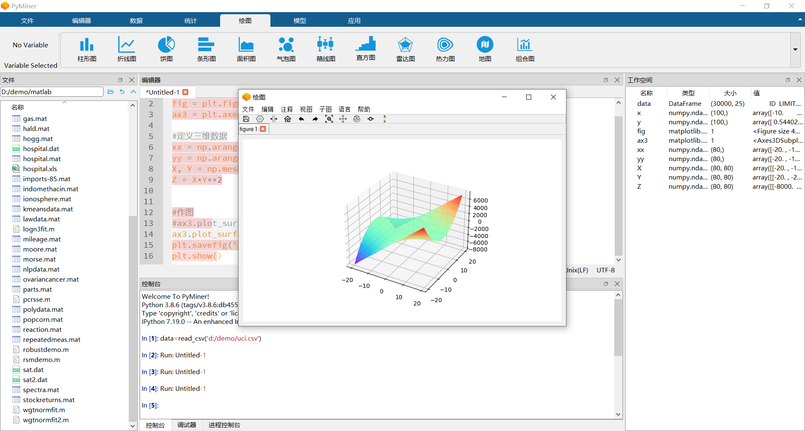

# 创意周刊：第 38 期（20201231）

[创意周刊](https://www.yuque.com/u86464/weekly)是基于每周阅读的新闻、时事、图片和技术等内容的综合分享平台，同步更新于 [GitHub](https://github.com/logeast/weekly) 和 [Gitee](https://gitee.com/logeast/weekly) 的 [logeast/weekly](https://github.com/logeast/weekly)。

这周末参加了 Gitee Day 的分享，Gitee 有一个 GVP 的开源项目计划，是 Gitee 综合评定出来的优秀开源项目的展示平台。这次分享就是一次 GVP 线下 Meetup，一共分享了 包括前后端接口请求解决方案、PHP 框架的新思路、人工智能框架、开源数据库、python 数据分析及云监控系统六个方向的项目。
分享的嘉宾有大公司的代表，也有创业公司的技术大牛，还有用爱发电的纯粹的自研项目，关于这一部分内容的分享会放在资源栏目。

## 封面图

用 Vector2D 实现的 js [动效图](https://codepen.io/georgedoescode/pen/oNzopzG)。

## 资源

### 1. [py2cn](https://gitee.com/py2cn) / [pyminer](https://gitee.com/py2cn/pyminer)

PyMiner 一款基于数据空间的数学工具，通过加载各种插件实现不同的需求，用易于操作的形式，在统一的界面中，通过数据计算实现数据科学家所设想的任务。

### 2. [腾讯开源](https://gitee.com/Tencent) / [APIJSON](https://gitee.com/Tencent/APIJSON)

后端接口和文档自动化，前端(客户端) 定制返回 JSON 的数据和结构。APIJSON 是一种专为 API 而生的 JSON 网络传输协议 以及 基于这套协议实现的 ORM 库。为简单的增删改查、复杂的查询、简单的事务操作提供了完全自动化的万能 API。能大幅降低开发和沟通成本，简化开发流程，缩短开发周期。
适合中小型前后端分离的项目，尤其是 BaaS、Serverless、互联网创业项目和企业自用项目。

### 3. [hyperf](https://gitee.com/hyperf) / [hyperf](https://gitee.com/hyperf/hyperf) PHP 持久化框架

Hyperf 是基于 Swoole 4.5+ 实现的高性能、高灵活性的 PHP 协程框架，内置协程服务器及大量常用的组件，性能较传统基于 PHP-FPM 的框架有质的提升，提供超高性能的同时，也保持着极其灵活的可扩展性，标准组件均基于 [PSR 标准](https://www.php-fig.org/psr) 实现，基于强大的依赖注入设计，保证了绝大部分组件或类都是可替换与可复用的。

### 4. [MindSpore](https://gitee.com/mindspore) / [mindspore](https://gitee.com/mindspore/mindspore) 新型开源深度学习训练/推理框架

MindSpore 是由华为开源的一种适用于端边云场景的新型开源深度学习训练/推理框架。 MindSpore 提供了友好的设计和高效的执行，旨在提升数据科学家和算法工程师的开发体验，并为 Ascend AI 处理器提供原生支持，以及软硬件协同优化。

### 5. [openGauss](https://gitee.com/opengauss) / [openGauss-server](https://gitee.com/opengauss/openGauss-server) 关系型数据库管理系统

openGauss 是华为开源的一款开源的关系型数据库管理系统，它具有多核高性能、全链路安全性、智能运维等企业级特性。 openGauss 内核早期源自开源数据库 PostgreSQL，融合了华为在数据库领域多年的内核经验，在架构、事务、存储引擎、优化器及 ARM 架构上进行了适配与优化。作为一个开源数据库，期望与广泛的开发者共同构建一个多元化技术的开源数据库社区。

### 6. [xrkmonitor](https://gitee.com/xrkmonitorcom) / [xrkmonitor](https://gitee.com/xrkmonitorcom/open) 字符云监控系统

集监控点监控、日志监控、数据可视化及监控告警为一体的分布式开源监控系统。
通过插件方式支持常用监控需求，插件可自由选择且支持一键部署、移除、启用、禁用等操作。

### 7. [uView UI](https://gitee.com/xuqu) / [uView](https://gitee.com/xuqu/uView) 多平台快速开发的 UI 框架

uView UI，是 [uni-app](https://uniapp.dcloud.io/) 生态优秀的 UI 框架，全面的组件和便捷的工具会让你信手拈来，如鱼得水。

