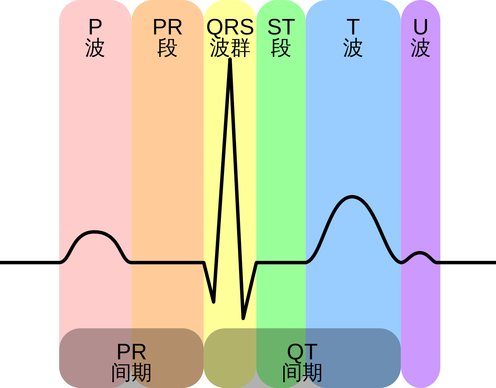
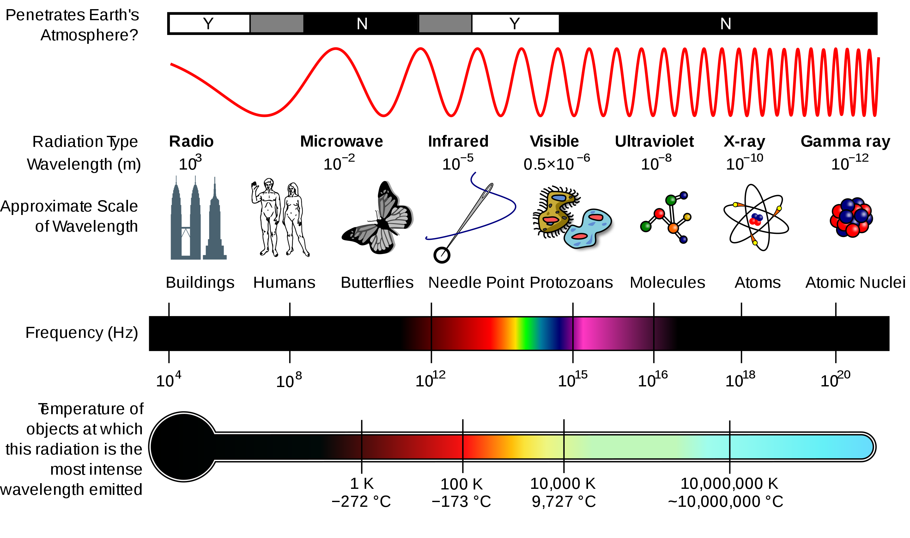
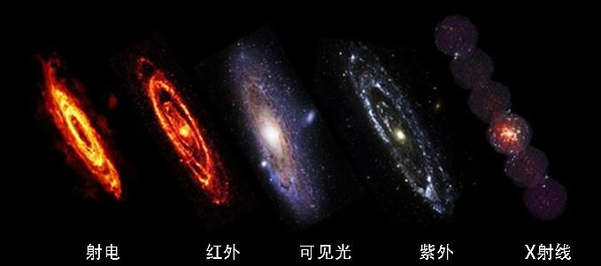
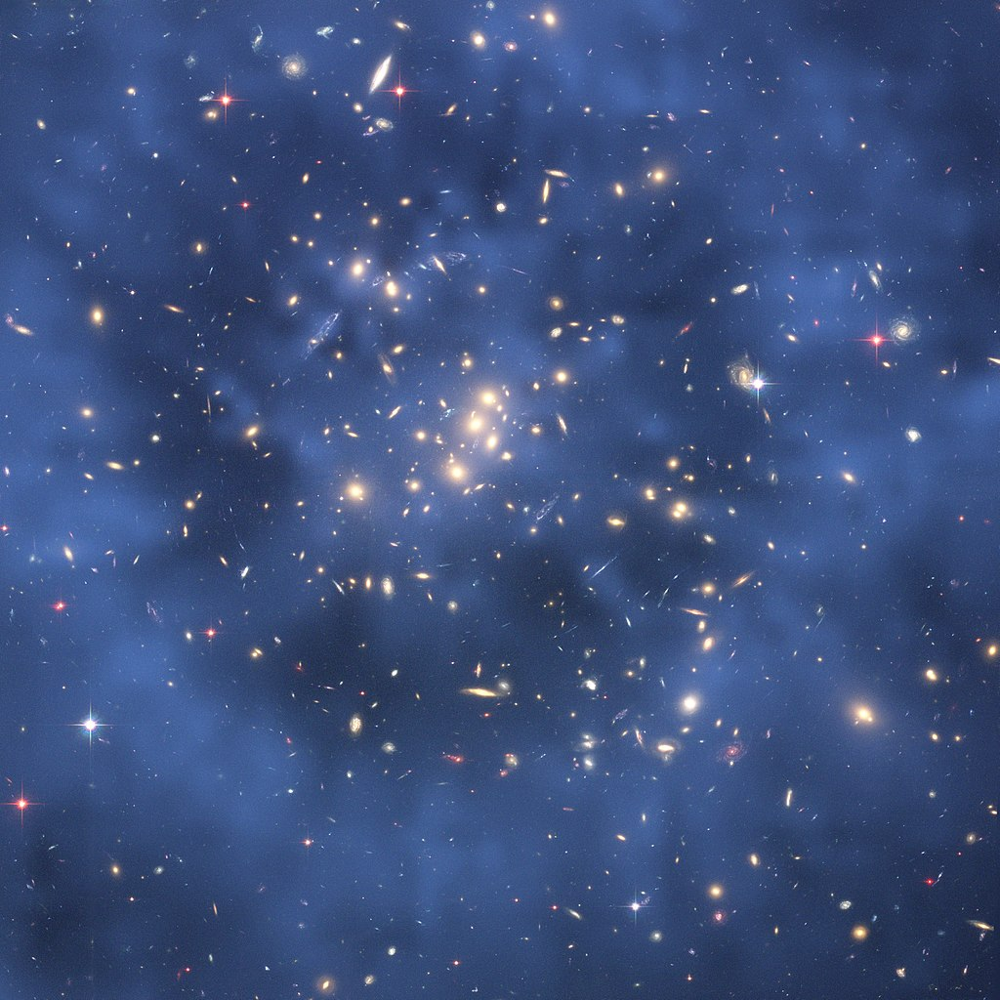
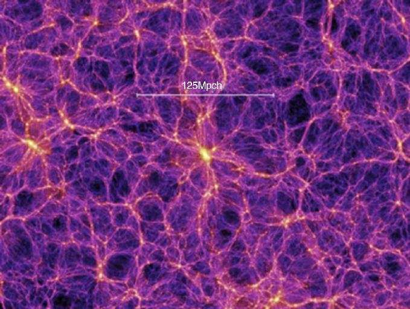
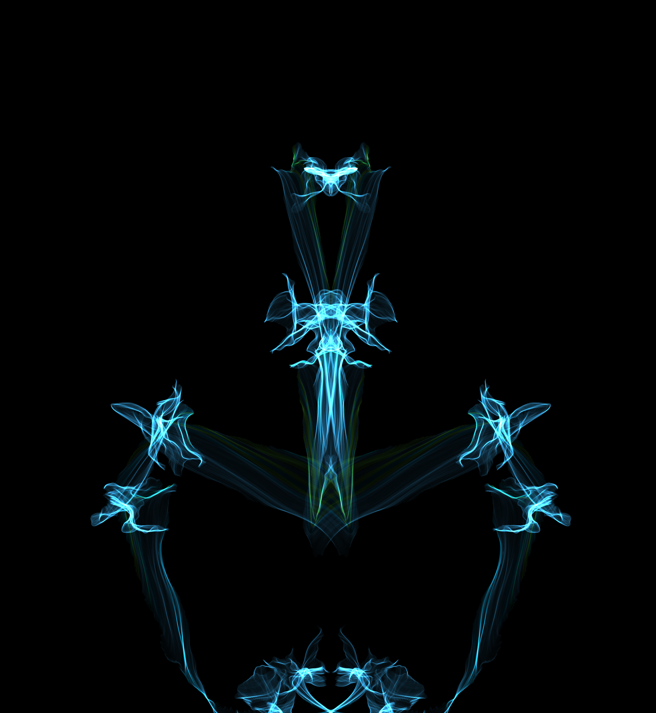
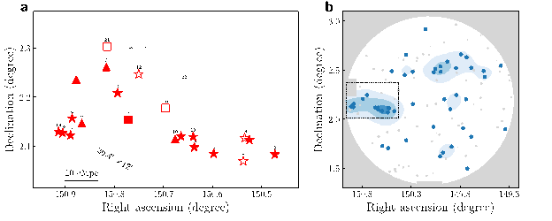

# 创意周刊：第 39 期（20210228）

[创意周刊](https://www.yuque.com/u86464/weekly)是基于每周阅读的新闻、时事、图片和技术等内容的分享平台，同步更新于 [GitHub](https://github.com/logeast/weekly) 的 [logeast/weekly](https://github.com/logeast/weekly)。

> 即日起，周刊新增科普小知识，用简单的描述解释我们生活中经常听到的专业词汇。

## 封面图

## 科普小知识

### 1. 心电图（ECG）

[常规心电图 (ECG) ](https://www.msdmanuals.com/zh/professional/cardiovascular-disorders/cardiovascular-tests-and-procedures/electrocardiography?query=%E5%BF%83%E7%94%B5%E5%9B%BE)是一项快速、简单、无痛的检查，它能将心脏产生的电冲动放大并记录。这份记录，也就是心电图（亦称为 ECG）。通常有胸痛、呼吸困难、心跳加快或异常、腿部肿胀等现象时，医生可能会通过心电图来进行症状评估。心电图可以帮助医生了解下面这些内容：

-   是否心脏病发作
-   有无异常心律
-   心脏是否得不到充足的血液和氧气
-   心脏是否扩大、肥厚等

一张心电图记录包括以下几部分

图片来源：[File:EKG Complex zh.svg](https://commons.wikimedia.org/wiki/File:EKG_Complex_zh.svg)。

> P 波代表心房除极。
> PR 间期是从心房开始除极到心室开始除极的时间，正常 PR 间期为 0.1 ～ 0.2 秒。
> QT 间期是从心室除极开始到心室复极结束的时间。
> QRS 波群代表心室除极。
> ST 段表示心室肌除极完成。正常时与 PR 段代表的基线平齐，或轻微偏移。
> T 波反映心室复极。
> U 波常见于低钾血症、低镁血症或缺血的病人，部分正常人也有。

### 2. 电磁波

[电磁波](https://zh.wikipedia.org/zh-cn/%E7%94%B5%E7%A3%81%E6%B3%A2)是指同相振荡且互相垂直的电场与磁场，在空间中以波的形式传递能量和动量，其传播方向垂直于电场与磁场的振荡方向。
电磁波不需要依靠介质进行传播，在真空中其传播速度为光速。电磁波可按照频率分类，从低频率到高频率，主要包括无线电波、兆赫辐射、微波、红外线、可见光、紫外线、X 射线和伽马射线。人眼可接收到的电磁波，波长大约在 380 至 780nm 之间，称为可见光。光实质上是电磁波。

下图为同一星系在不同波段（射电、红外、可见光、紫外及 X 射线）下的图像。

### 3. 暗物质

有一类很诡异的物质暗藏在宇宙中，它既不发光，也不和光发生吸收、反射或折射等作用，不仅在没有光的黑暗中看不到它，在有光线的环境中也完全透明，同样看不到它。这种不发光又绝对透明，在任何环境下都无法看到却又有质量的物质，被称为暗物质，即暗藏在宇宙中的物质。

目前已知暗物质能通过引力作用而被感知到。为此科学家们发明了一种“引力透镜质量分布成像”（gravitational lens mass tomography）法，绘制出宇宙中暗物质的分布。普遍认为整个宇宙中，暗能量占 68.3%，暗物质占 26.8%，其他可见物质仅为 4.9%，即在所有物质中，诡异的暗物质竟然占了 85% 。
研究发现，第一，宇宙中暗物质无处不在。星系内部充满着暗物质，即便是宇宙中最明亮的星系内部也存在着暗物质。
第二，从大尺度看，宇宙就像由众多星系构成的庞大的、呈现为丝状或卷须状的“宇宙网”，暗物质分布在“宇宙网”状结构中空旷的“网眼”内，将网上的千万个星系相互“黏结”在一起。

该图来自哈勃对星团 Cl 0024 + 17 的引力如何使更远的星系的光线扭曲的光学观测，这种光学观测称为引力透镜。尽管天文学家看不到暗物质，但他们可以通过映射背景星系的变形形状来推断暗物质的存在。图中的蓝色区域就是在哈勃望远镜的图像上叠加上的暗物质分布。

下图为数字模拟得到的大尺度宇宙内的暗物质分布图。

## 教程

### 1. 【英】[CSS Animation](https://cssanimation.rocks/) CSS 动画资源库

CSS 动画文章，技巧和教程，升级你的 CSS 动画技能。

### 2. 【英】[深入理解网页设计中的阴影](https://css-tricks.com/getting-deep-into-shadows/)

在网页设计中，使用光和阴影可以增加物理现实主义，并可用于制作丰富、触觉化的界面。这篇教程从现实出发，利用光的物理现象，讲述光和阴影之间的关系以及光对阴影的影响，进而拓展到网页世界的颜色选择器和阴影的应用。
分别介绍了内阴影、分层阴影、阴影的可访问性、阴影和性能以及阴影是否影响布局等内容，最后介绍了一些阴影的最佳实践以及一些有趣的阴影实现。

### 3. [【英】深入研究伪元素 ::before 和 ::after](https://codersblock.com/blog/diving-into-the-before-and-after-pseudo-elements/)

这篇文章深入讲述了伪元素 ::before 和 ::after 的一些用法。

### 4. [gothinkster](https://github.com/gothinkster)/[realworld](https://github.com/gothinkster/realworld)

"Demo 之母，提供了系列示范教程" ——由 React, Angular, Node, Django 等团队提供。

## 资源

### 1. [react-figma](https://github.com/react-figma)/[react-figma](https://github.com/react-figma/react-figma)

Figma 的 React 渲染器。在 Figma 中使用 React 组件。

### 2. DEV RESOURCE 开放资源列表

一份开放的资源列表，包括资产、独立博客、基础设施、工作、编程、阅读与写作、工具和实用工具和 UI 设计等方面。

### 3. [r-spacex](https://github.com/r-spacex)/[SpaceX-API](https://github.com/r-spacex/SpaceX-API)

用于火箭，核，太空舱，发射台和发射数据的开源的 REST API。

> 与 Space Exploration Technologies Corp（SpaceX）或其任何子公司或分支机构之间没有任何附属关系，关联关系，授权，认可或以任何方式与之正式关联。 SpaceX 名称以及相关名称，标记，标志和图像是其各自所有者的注册商标。

### 4. 基于浏览器的[任意图片转 AVIF 格式](https://avif.io/)工具

多年来，由于 JPEG 的高兼容性，它一直是最受欢迎的图片格式，AVIF 是现代的解决方案。它是由开放媒体联盟(Alliance for Open Media)开发的，该联盟由谷歌、苹果(Apple)、Mozilla、英特尔(Intel)和其他科技巨头合作组成的。AVIF 是一个超压缩图像的编解码器，具有可接受的质量，而且它不断地变得更好。与当前的 JPEG 或 WebP 编解码器相比，AVIF 显著缩减了文件的大小，可以将文件大小减少 20-90%。

### 5. [Silk - 交互式生成艺术](http://weavesilk.com/)

通过鼠标交互生成对称的艺术图片。

## 图片

### 1. [科学家发现宇宙最遥远的原初星系团](https://physics.ustc.edu.cn/2021/0127/c3588a469921/page.htm)

中国、美国、智利三国天文学家系统搜寻宇宙黑暗时期莱曼阿尔法发射线星系候选者，通过分析测光选星系样本，发现了一个红移 ～ 6.9 的原初星系团候选者 LAGER-z7OD1。LAGER-z7OD1 是宇宙中已知最遥远的原初星系团。这项发现不仅仅是创造了一个红移记录，同时为宇宙再电离过程和再电离泡的后续深入研究提供了绝佳的观测目标。

左图：原初星系团 LAGER-z7OD1 中 Lyα 发射线星系的空间分布。
右图：COSMOS 天区中所有红移 ~7 的 Lyα 发射线星系的空间分布，图中的虚线方框表示着左图原初星系团所在的位置。

### 2. NASA 使用 Three.js 渲染了[火星车着陆过程](https://eyes.nasa.gov/apps/mars2020/#/home?time=2021-02-19T04:44:04.816+08:00&rate=0&id=surface_operations)

