# 创意周刊（第 41 期）：游戏设计中的黑暗模式

创意周刊是基于每周阅读的新闻、时事、图片和技术等内容的分享平台，每周五发布。

## 封面图：[建造世界上最大的射电望远镜阵列](https://www.skatelescope.org/news/green-light-for-ska-construction/)

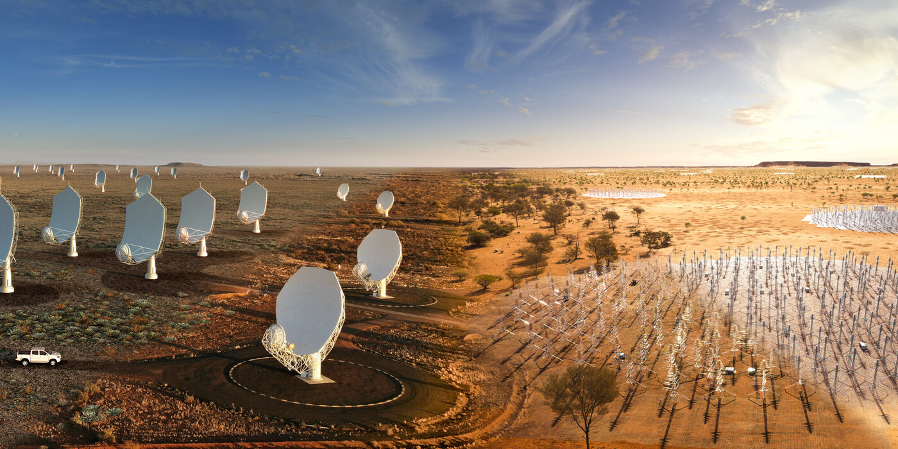

SKA 的综合图像，结合了南非和澳大利亚的所有元素。此图像将已经建成的真实照片与艺术家对未来 SKA 天线的设想融为一体。

SKA 天文台，是全球各国合作的一个组织，其使命是建造和操作尖端射电望远镜，以改变我们对宇宙的理解，并通过全球合作和创新为社会带来好处。最近其成员通过了一项批准：要在澳大利亚和南非开始建设 SKA 望远镜阵列，这将是有史以来建造的最大和最复杂的射电望远镜阵列。

## 本周话题：游戏设计中的黑暗模式

黑暗游戏模式是游戏设计师故意将一些内容添加到游戏中，为玩家创造不必要的负面体验的设计模式。这些模式通常以牺牲玩家的享受为代价，使游戏设计师受益。

游戏设计师常用的黑暗模式有以下几种：

**时间黑暗模式**旨在让你花费比原计划更多的时间玩游戏。一个好的游戏体验是玩家可以自己选择游戏时长，但游戏设计师会通过一些方式来诱导玩家沉迷游戏。常见的有约定时间、每日奖励、重复任务、无限时间、无法暂停或保存和等待指定时间等手段。

**金钱黑暗模式**旨在诱导玩家在游戏中花费比预算更多的钱。常见的有按月付费、虚拟游戏币、支付流程缩短、限时抢购、意外购买、抽奖、永久购买的物品贬值、不付费不能继续玩、限制库存迫使清空或升级和锚定技巧（将廉价商品放在昂贵的商品旁边，使其看起来更实惠）等方式。

**3. 社交黑暗模式**允许玩家分享游戏，从而引导朋友和家人来玩游戏。常见的有社交金字塔计划（邀请拿奖励）、社交义务（不想让朋友失望）、垃圾邮件、互利互惠、害怕错过（一旦停止就无法赶上）和比赛等方式。

**4. 心理黑暗模式**是引导你做出错误决定的心理技巧。游戏可以使用许多心理技巧来说服你继续玩，即使游戏不再有趣。常见的有投资（已经花费了时间或金钱来提升游戏中的地位）、徽章或赋予进步、碎片收集、掌控游戏的幻觉、随机奖励、意识引导和频率偏差（让玩家认为获胜的几率比实际要高）。

如果你正在玩的游戏有以上几点行为，你就要注意了，说明你可能已经被游戏绑架了。

[Dark Pattern Games](https://www.darkpattern.games/) 是一个游戏评论网站，致力于帮助玩家找到健康的手机游戏。如果你想了解更多内容，可以阅读这篇论文，[Dark Patterns in the Design of Games](http://www.fdg2013.org/program/papers/paper06_zagal_etal.pdf)。

## 科技动态

### 1. [天文学家在 Palomar 5 星团中发现了一个超大的黑洞群](https://www.ub.edu/web/ub/en/menu_eines/noticies/2021/07/006.html?)

巴塞罗那大学的一个由天文学家和天体物理学家组成的国际研究小在 Nature Astronomy 上发表了一篇论文，指出 Palomar 5（帕洛玛 5 号）的中心可能有 100 多个黑洞组成的超大黑洞群。他们的理由有两个。

1. Palomar 5 是银河系中"最蓬松"的星团之一，恒星之间的平均距离为几光年，与太阳到最近恒星的距离相当；
2. Palomar 5 有一个与它相关的光谱恒星流，跨越天空 20 多度。

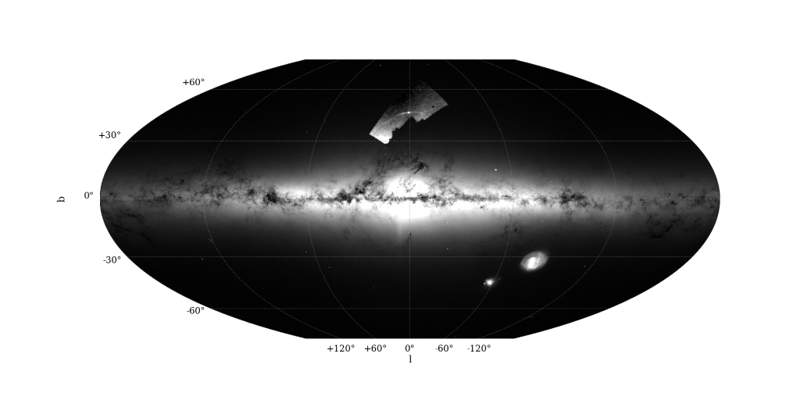

使用 Gaia eDR3 数据生成的银河系的平面图，越亮的区域恒星越多。顶部中心的小补丁显示了 Palomar 5 及其潮汐尾部。

黑洞在与恒星的引力弹弓相互作用中动态地膨胀了星团，这导致了恒星外逃和流的形成。

这次发现表明“在形成溪流的所有星团中，黑洞种群的存在可能很常见"，对人类了解球状星团的形成、恒星的初始质量和大恒星的演化非常重要。

### 2. [让 AI 来解读人类情绪？是时候管管这些工具了！](https://mp.weixin.qq.com/s/1OeWGJXaDV7V78UgcXbcVA)

新冠疫情期间，科技公司一直在推销他们的情绪识别软件，用于远程监测企业职员乃至儿童，比如一个名为 4 Little Trees 的系统，声称能侦测孩子完成作业时的情绪。它能映像每个孩子的面部特征，把孩子的情绪状态分为快乐、悲伤、愤怒、恶心、惊讶和恐惧。它还能估计“动机”和预测成绩。

心理学家 Paul Ekman 在 60 年代所出了一个假设，即所有人类都有少数几种“基本”情绪，这些情绪是天生的，具有跨越文化的一致性。很明显这是有争议的，它忽略了背景、文化和社会因素。

但是，Ekman 所描述的六种情绪特别契合计算机视觉这一新兴领域的模式。这刚好迎合了这类情绪工具的能力范围：基于六种固定不变的情绪进行分析，因为这可以大规模地标准化和自动化——只要无视更复杂的问题就好了。

我们不应该允许情绪识别技术继续野蛮生长。在教育、卫生、雇佣和司法等所有领域，应立法禁止这些工具在未经证实的情况下被使用。

### 3. [开普勒望远镜瞥见大量自由漂浮行星](https://ras.ac.uk/news-and-press/research-highlights/kepler-telescope-glimpses-population-free-floating-planets)

宇宙中存在这样一类行星，它们不受任何主星的约束，自由漂浮在深空中。这些行星可能最初是在主星周围形成的，然后被宇宙中其他较重行星的引力拖曳而弹出。

艺术家心中的自由漂浮行星，A. Stelter / Wikimedia Commons

最近英国曼彻斯特大学的伊恩·麦克唐纳教授利用开普勒太空望远镜的数据发现了罕见的重力透镜事件（Gravitational Microlensing Effect）。这些新事件没有伴随显示来自主星的较长信号，这表明可能是自由漂浮的行星。

重力透镜效应（gravitational lensing），根据广义相对论，就是当背景光源发出的光在引力场（比如星系、星系团及黑洞）附近经过时，光线会像通过透镜一样发生弯曲。

下面是一个[模拟的重力透镜效应](https://www.youtube.com/watch?v=Wkf3AkVvPAM&t=5s)的视频，当来自银河系深处的光经过孤立的行星时，会发生弯曲。

[从地球上看到的微透镜信号的动画，大卫·斯佩克特 / 伊蒙·克林斯 / 曼彻斯特大学](https://s3-us-west-2.amazonaws.com/secure.notion-static.com/8223281c-d30c-4dd3-b07f-ee15e3bdac31/Animation_of_a_microlensing_signal_as_seen_from_Earth.mp4)

从地球上看到的微透镜信号的动画，大卫·斯佩克特 / 伊蒙·克林斯 / 曼彻斯特大学

开普勒不是用来寻找行星的，现在却实现了它从未设计过的目标，为自由漂浮行星群的存在提供了进一步的实验证据。

### 4. [科学家利用卫星数据来跟踪海洋微小塑料碎片](https://news.umich.edu/ocean-microplastics-first-global-view-shows-seasonal-changes-and-sources/)

据估计，每年有 800 万吨塑料垃圾进入海洋，其中大部分被太阳和海浪处理成微小的塑料碎片。这些碎片会损害海洋生物和海洋生态系统，而且很难追踪和清理。

旋风全球导航卫星系统（CYGNSS）由 2016 年推出的 8 颗微型卫星组成，用于监测大型风暴系统中心附近的天气，并对其严重程度进行预测。

密歇根大学的研究人员开发出一种利用旋风全球导航卫星系统（CYGNSS）的新方法来发现全球的海洋微塑料，并随时跟踪它们的，提供它们进入水中的位置、移动方式和收集地点。

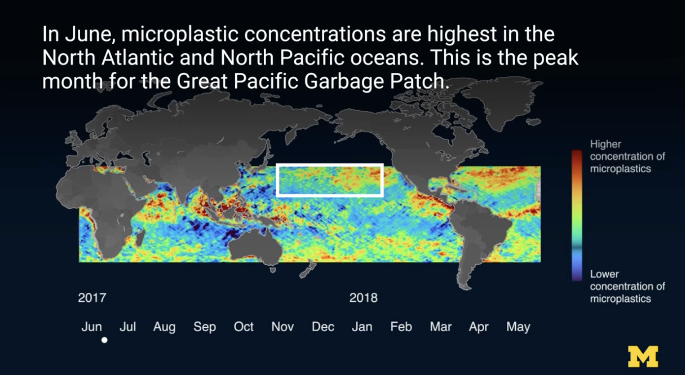

## 文章

### 1. [通过三个简单的想法让选举投票图更加清晰](https://blog.datawrapper.de/visualizing-election-polls)

今年 9 月德国将举行新总统的选举。各大媒体对选举民意测验的报道往往具有误导性，作者分析选举民意测验报告的一些基本问题并给出解决方案。

#### 1. 报告误差幅度

在德国，选举投票通常基于 1,000 至 3,000 人的样本，然后用统计方法推断，以代表该国所有选民。此过程的误差幅度约为正负两到三个百分点，例如，如果一个候选人的民调结果为 50%，误差幅度为正负三个百分点，则意味着实际数字在 47% 到 53% 之间，这就很大程度影响了选票的结果。

因此需要尽可能突出显示误差幅度。

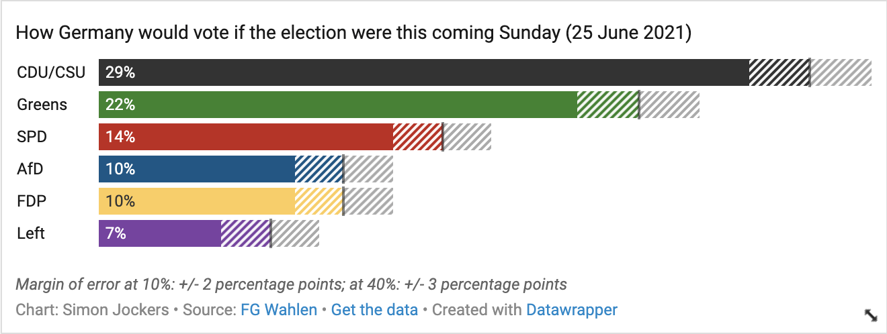

#### 2. 考虑偏离投票

产生选举投票的组织多种多样，结果往往大相径庭。有时，民意测验者可能只是弄错了，而没有任何政治偏见。

解决这个问题的一个方法是查看来自多个民意调查机构的数据。

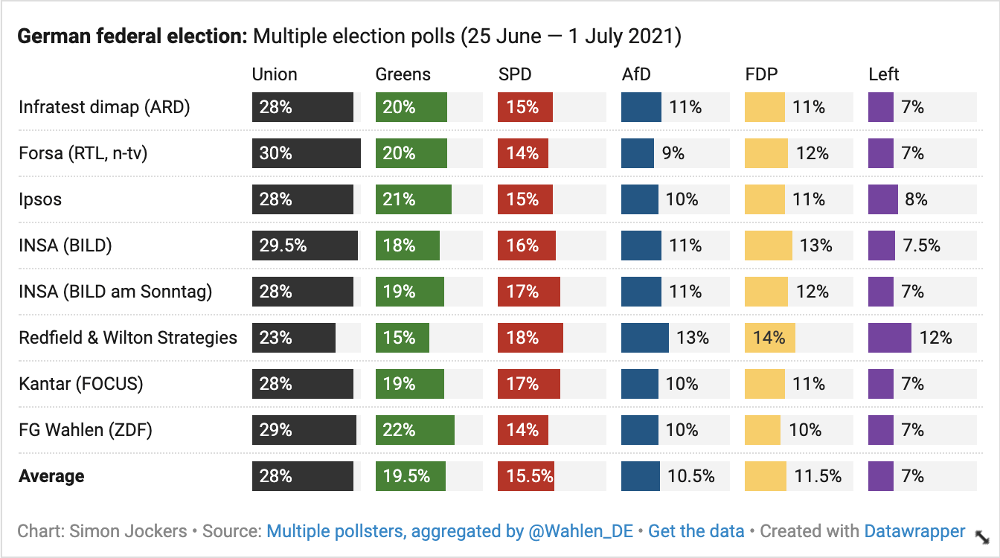

#### 3. 显示投票如何随着时间而变化

单一的选举民意测验在某个时间点反映了民意。在竞选期间，公众舆论可能会发生重大变化。

因此需要显示民调如何随着时间而变化。

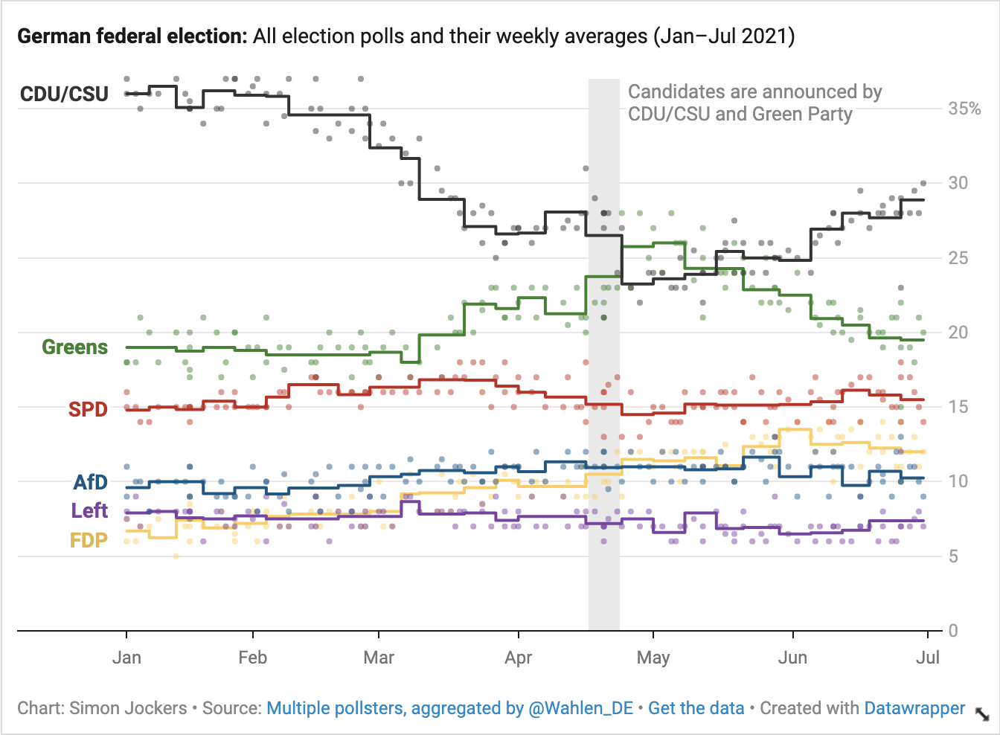

### 2. [如何使用 JavaScript 创建 NFT](https://blog.logrocket.com/how-to-create-nfts-with-javascript/?utm_medium=email&utm_source=topic+optin&utm_campaign=awareness&utm_content=20210703+prog+nl&mkt_tok=MTA3LUZNUy0wNzAAAAF-C9wgJJ1irPxSG9uyYdmpEy6__Bwd7oGWfH8vaba2xWfhmov5_ckvzvFrDjaAvKn2CSs754WseSFH3-Tce6SIAgMovCfYczHNOlgTh8be37lbQw8#utm_medium=email&utm_source=topic+optin&utm_campaign=awareness&utm_content=20210703+prog+nl&mkt_tok=MTA3LUZNUy0wNzAAAAF-C9wgJJ1irPxSG9uyYdmpEy6__Bwd7oGWfH8vaba2xWfhmov5_ckvzvFrDjaAvKn2CSs754WseSFH3-Tce6SIAgMovCfYczHNOlgTh8be37lbQw8)

2021 年 2 月，菲格玛首席执行官迪伦·菲尔兹以 750 万美元售出了一件NFT艺术品。同样，Twitter 联合创始人杰克·多尔西以 2，915，835.47 美元的价格在 Twitter 上以 2，915，835.47 美元的价格出售了他的第一条微博。

NFT（不可替换令牌）是一项迷人的新技术，以数字方式表示资产所有权。这篇教程指引我们如何先写一个自己的 NFT 产品。

### 3. [在 JavaScript 中排序颜色](https://tomekdev.com/posts/sorting-colors-in-js)

项目中用到的颜色太多了，随机排序就显得乱糟糟的，这篇文章提供一种将颜色按照二维空间排序的算法和实现教程。

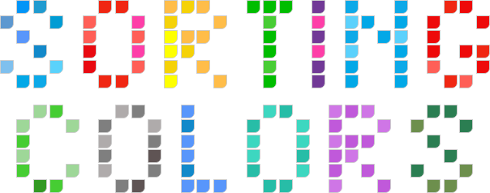

## 工具

### 1. [npr joy generator](https://apps.npr.org/joy-generator/#story=about&page=0)

我们的大脑创造了情绪，以用来回应我们现在所经历的和我们过去的感受。每日少量的快乐可以转移我们的注意力，释放我们的忧虑，带来更多的喜悦。

NPR 收集了一些欢乐的东西，花时间享受小小的快乐时刻来提升幸福感吧。

### 2. [SigNoz](https://github.com/SigNoz)/**[signoz](https://github.com/SigNoz/signoz)**

一款帮助开发者监控应用程序和故障问题，是 DateDog、New Relic 这类工具的替代品。

### 3. [shivammathur](https://github.com/shivammathur)/**[setup-php](https://github.com/shivammathur/setup-php)**

一款设置 PHP 所需的扩展、php .ini 配置、代码覆盖率的 GitHub Action。

### 4. [anuraghazra](https://github.com/anuraghazra)/**[github-readme-stats](https://github.com/anuraghazra/github-readme-stats)**

在你的 README 中获取动态生成的 GitHub 统计信息。

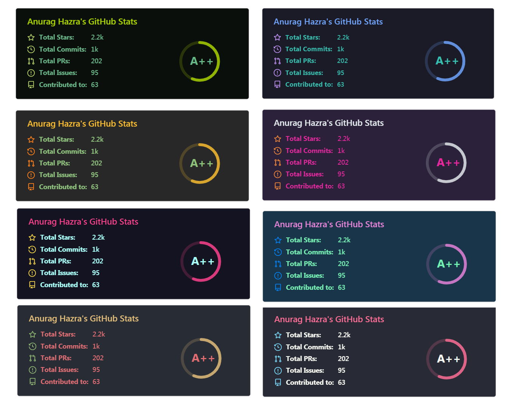

### 5. [了解你的依赖关系](https://deps.dev/)

这是谷歌的一个实验项目，扫描位于 GitHub、npm 包、pkg.go.dev 等地方的包信息的依赖图。

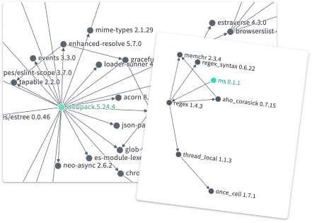

## 资源

### 1. [bradtraversy](https://github.com/bradtraversy)/**[50projects50days](https://github.com/bradtraversy/50projects50days) **

50 个独立的小型项目，以锻炼 HTML、CSS 和 JavaScript 技能。对于前端基础技能的锻炼还是很有帮助的。

### 2. [Access Guide](https://accessguide.io/) 可访问性指南

这是一份友好的数字无障碍设计的介绍，用于帮助理解 [WCAG 2.1](https://www.w3.org/TR/WCAG21/)（Web内容无障碍指南）标准。

## 图片

### 1. [需要多少森林，才能养大一棵树？](https://mp.weixin.qq.com/s/slQ2JWQNdq0DhTnapdgZEg)

1997 年，生态学家 Suzanne Simard 在不列颠哥伦比亚省发现了树根和菌丝组成的地下网络，这一发现登上了《自然》封面。真菌网络（即后来广为人知的“树维网”）的发现，颠覆了生态学界主流科学的理念——物种竞争是塑造森林的主要动力。与之相反，森林生态更像是一支细腻的舞蹈，**物种之间时而竞争，时而合作**。

Simard 还发现相比于其他无关的树苗，**树木会给自己的后代输送更多资源**。这一成果表明，树木通过网络保持某种水平的控制，或能称之为智能。植物似乎具有能动性，它们会感知、联系、交流、决策、学习和记忆。

加拿大不列颠哥伦比亚省的道格拉斯冷杉：“母树”帮助周围的幼苗茁壮成长。来源：Getty

真菌的线状根是“树维网”的重要组成部分。通过“树维网”，树木之间可以进行有机物、水分、养分和信息的交换。

来源：Claire Welsh

### 2. [第十三届年度天文摄影师大赛](https://www.rmg.co.uk/national-maritime-museum/astronomy-photographer-year-2021-shortlist-images)

2021 年天文摄影师大赛公布入围作品。每年大赛都会选取世界各地天文摄影师投寄的优秀摄影作品。获奖和入围图片将在国家海事博物馆举办的年度天文学摄影师展（9月18日开幕）中展出。

我选了几张自己喜欢的列到这里。

中国摄影师 Yang Sutie 拍摄作品《Star Watcher》

匈牙利摄影师Péter Feltóti拍摄作品《Bicolour Veil Nebula》

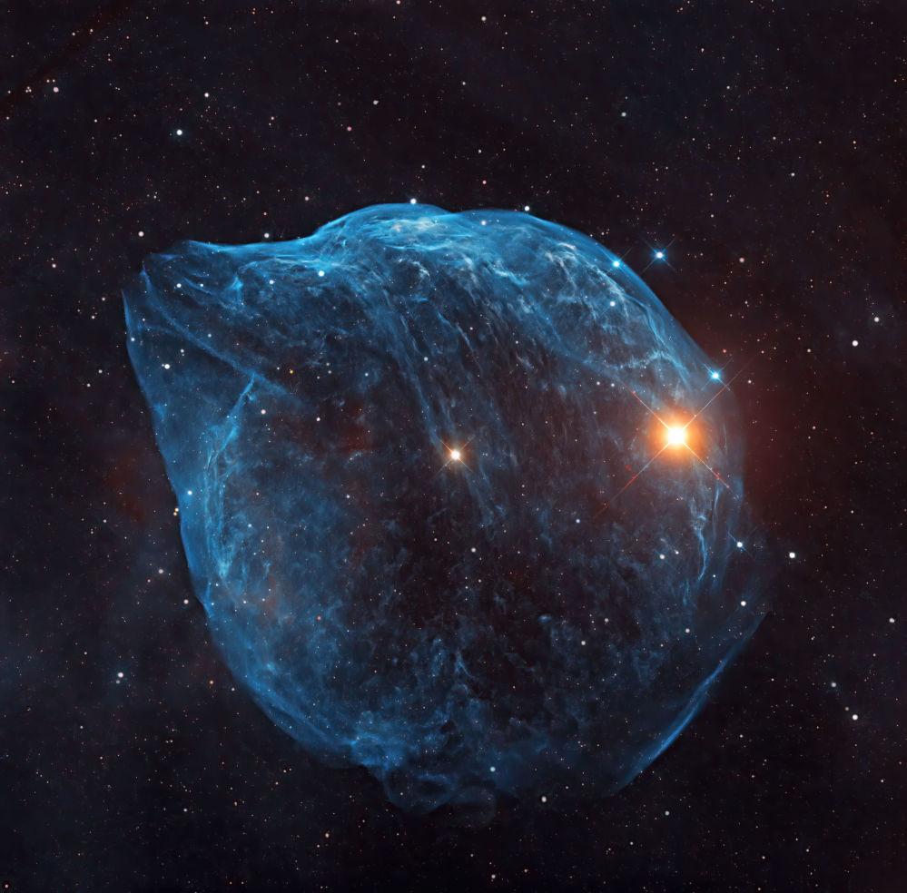

斯里兰卡摄影师 Yovin Yahathugoda 拍摄作品《Dolphin Head Nebula》

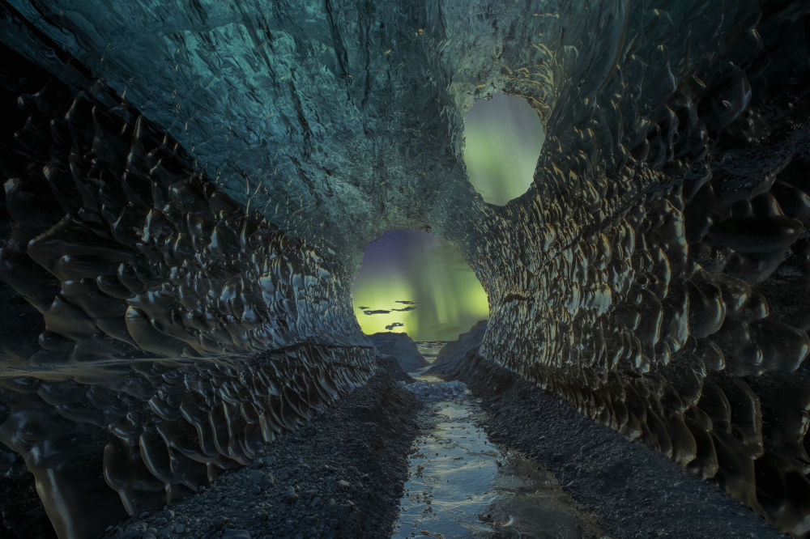

德国摄影师 Markus van Hauten 拍摄作品《The Cave》

## 文摘

### 1. [亲爱的年轻设计师](https://vanschneider.com/blog/dear-young-designer/?ref=sidebar)

作者：Tobias van Schneider

- 如果你想知道房间的人是否在吹牛，那他们就是。
- 如果你对别人的成功感到灰心丧气，或者担心你不是设计人群的一部分，那么你花太多时间上网。退出推特， 为自己做点什么，其他的并不重要。
- 如果你得到了别人不想做的一个小任务，尽你所能去做。即使是小东西也可以是一个很大的机会。
