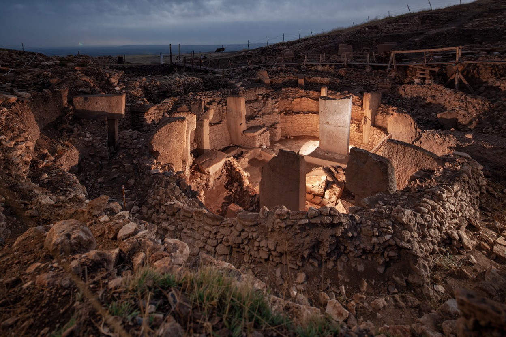
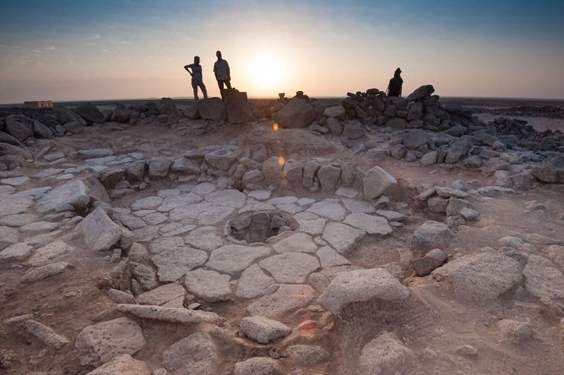
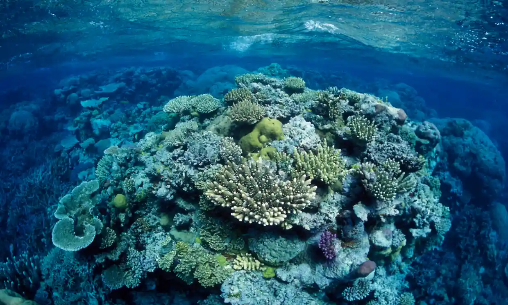
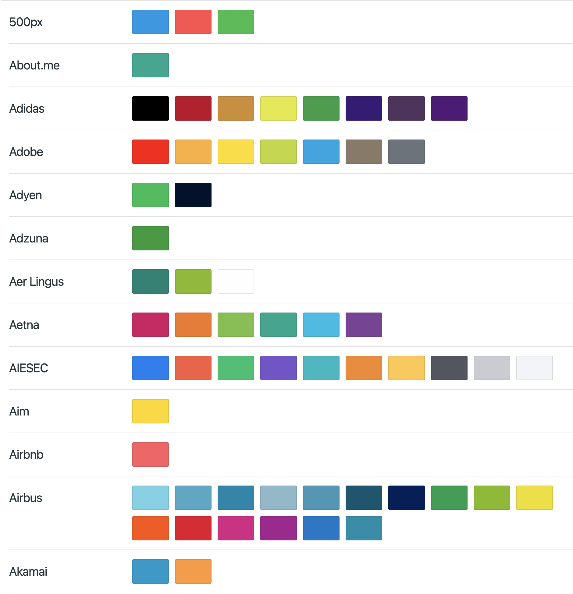
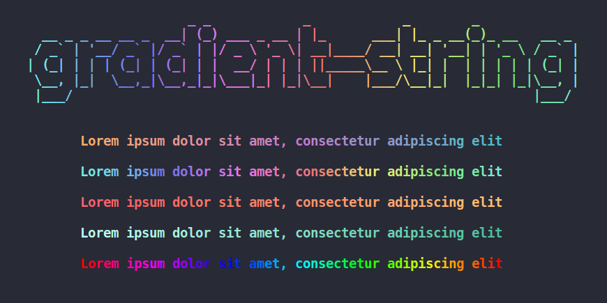
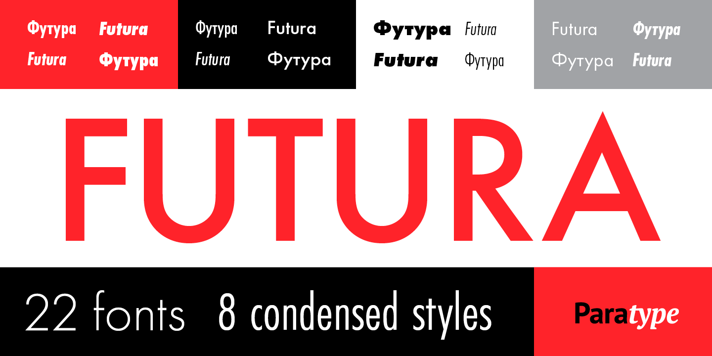
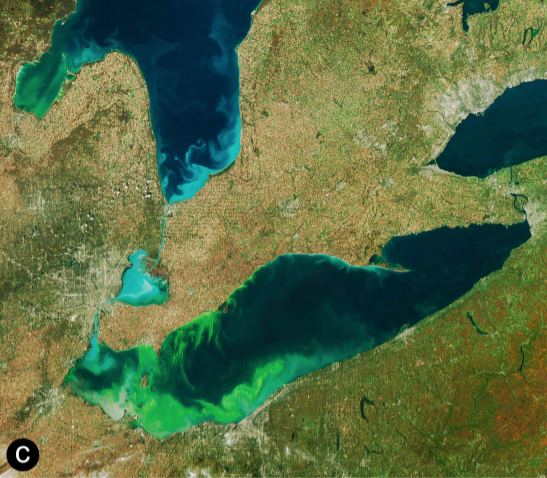
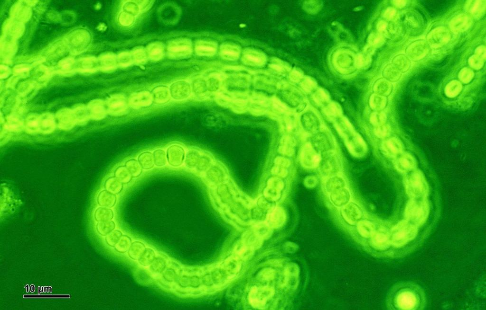

# 创意周刊（第 43 期）：古代人与面包、啤酒和其他碳水化合物

创意周刊是基于每周阅读的新闻、时事、图片和技术等内容的分享平台，每周三发布。

## 封面图

土耳其哥贝克力石阵（Gübekli Tepe）的遗迹：这是世界上最古老的寺庙之一，距今 11,000 多年。



## 本周话题：古代人与面包、啤酒和其他碳水化合物

研究发现，早在十万年前，人类就已经开始食用淀粉类植物，这时间点甚至在这些植物被驯化之前。



阿玛亚·阿兰茨-奥塔吉考察了约旦东北部舒巴伊卡 1 号考古遗址附近的谷物种植情况，她和她的同事在那里发现了大约 14,000 年前烘烤面包的证据。

### 研究古代植物的一种方法

先说说古植物学家研究古代植物的一种方法，研究人员使用筛子、细网和水桶清洗和分离考古遗址的碎片。微小的有机物质，如种子，烧焦的木材和烧焦的食物漂浮到顶部，而较重的污垢和岩石下沉。

通过识别和计数混合在土壤中的草籽、谷物碎片、烧焦食物的遗骸，古植物学家可以判断在定居点周围地区生长的是什么。一旦特定物种的数量有异常，就很可能证明这些植物可能过去曾被人们使用过，或许还会被栽培过。

### 磨石花园

哥贝克力石阵（Göbekli Tepe） 有一处“花园”，用于放置被挖出的岩石器具，"花园"覆盖了一个足球场大小的区域，里面装着 1万多块磨石和近 650 个雕刻石盘和容器，有些大到足以容纳 200 升液体。

这表明尽管没有驯化作物，但智人已经熟悉了谷物的烹饪，很可能在农耕文化开始之前，谷物就成了日常主食。

### 更多消化淀粉的基因

遗传数据表明，人类比任何灵长类动物的亲属都拥有更多的基因来消化淀粉。人类基因的变化决定了饮食，对于智人来说，高淀粉饮食占有很大优势。

## 科技动态

### 1. [为保护濒危的灵长类动物而斗争](https://www.nature.com/articles/d41586-021-01995-9?utm_source=Nature+Briefing&utm_campaign=b8fd7fd827-briefing-dy-20210720&utm_medium=email&utm_term=0_c9dfd39373-b8fd7fd827-46538514)

安蒂·昂是新加坡曼代自然的灵长类动物学家，安蒂·昂在新加坡建造绳索桥，并正在努力与其他国家开展灵长类动物交流，以确保濒危物种的安全。这些猴子面临的最大威胁之一是近亲繁殖，因此他们的数量一直在减少。

下图是 2017 年她们监测灵长类动物的数量时拍到的，他们正在观察彼此，并尊重彼此的空间。


### 2. [暂缓将澳洲大堡礁列入濒危世界遗产名录](https://www.theguardian.com/environment/2021/jul/23/world-heritage-committee-agrees-not-to-place-great-barrier-reef-on-in-danger-list?utm_source=Nature+Briefing&utm_campaign=3821c90083-briefing-dy-20210727&utm_medium=email&utm_term=0_c9dfd39373-3821c90083-46538514)

大堡礁是世界上最大的珊瑚礁系统。健康的珊瑚礁是海洋生物多样性的核心。据预测，以珊瑚为主的生态系统将是最早因全球变暖而崩溃的生态系统之一。

由于海洋温度的上升，2016 年、2017 年和 2020 年的大规模珊瑚漂白事件导致珊瑚大量流失。 联合国教科文组织呼吁将大堡礁列入濒危世界遗产名录，以此来保护该生态系统，但澳大利亚政府不愿意，称联合国教科文组织应该首先派出一个监测团，来请确认是否真的处于濒危状态。

究其本质，其原因主要有以下两点，

1. 大堡礁是澳大利亚的旅游景点，为政府带来 7000 万的就业机会；
2. 如果珊瑚礁被列入“濒危”名单，矿物燃料开采的社会许可就会消失。



## 文章

### 1. [Replacing jQuery with Vanilla ES6](https://aarontgrogg.com/blog/2021/09/29/replacing-jquery-with-vanilla-es6/)

使用 ES6 替换 jQuery 中的一些写法，有元素选择器、父元素选择器、添加删除 CSS 类名、设置和获取元素属性、插入文本、HTML 元素、数组和对象的循环、事件监听和异步请求等。

## 工具

### 1. [BrandColors](https://brandcolors.net/)

这个网站收集了很多知名网站的品牌色。



### 2. [AmraniCh](https://github.com/AmraniCh)/**[github-code-font-changer](https://github.com/AmraniCh/github-code-font-changer)**

一款浏览器插件，用于切换和自定义 GitHub 代码的字体。

有以下字体可以用。

```md
Fira Code.
Source Code Pro.
Roboto Mono.
Ubuntu Mono.
Courier Prime.
JetBrains Mono.
Share Tech Mono.
PT Mono.
Oxygen Mono.
Space Mono.
Inconsolata.
Anonymous Mono.
IBM Plex Mono.
```

### 3. [Echarts Theme Builder](https://echarts.apache.org/en/theme-builder.html) Apache Echarts 主题构建工具

为你的图表定制样式。


### 4. [bokub/gradient-string](https://github.com/bokub/gradient-string)

在终端输出漂亮的渐变字体。



## 创意

### 1. Adobe Futura PT Fonts

Adobe 系列的一款漂亮的字体。


### 2. [Docusaurus](https://docusaurus.io/zh-CN/) Facebook 开源的文档网站构建工具

Markdown 驱动的使用 React 快速构建以内容为核心的最佳网站。


### [Elementary Grid](https://teetow.github.io/elementary_grid)
使用 Elementary Audio 和 React 制作的音栅合成器。

## 图片

### 1. [光合作用是什么时候开始的？](https://www.universetoday.com/152808/when-did-photosynthesis-begin/)

光合作用最先是在蓝藻上产生的，确定了蓝藻的起源就确定了光合作用的开始时间。

[水平基因转移（horizontal gene transfer, HGT）](https://zh.wikipedia.org/zh-cn/%E5%9F%BA%E5%9B%A0%E6%B0%B4%E5%B9%B3%E8%BD%89%E7%A7%BB)是指生物将遗传物质传递给其他细胞而非其子代的过程。可以用这个规律去确定物种的年代，因为接收基因的物种总是比起源的物种年轻。

麻省理工大学一个研究小组基于以上方法研究得出，今天存在的蓝藻有共同祖先，距今 29 亿年，它们祖先在大约 34 亿年前从其他细菌中分离出来，光合作用一定是从两者之间的某个地方开始的。



2009年，伊利湖蓝藻的卫星图像。



把蓝藻放大 2400 倍。

### 2. [珊瑚礁（Coral reef）](https://zh.wikipedia.org/zh-cn/%E7%8F%8A%E7%91%9A%E7%A4%81)已经减少了 50%

珊瑚礁在海洋中占比小于 1%，但它们至少承载着 25% 的海洋物种。自 1950 年以来，珊瑚礁已经减少了 50%，海洋变暖，过度捕捞以及海洋中化学药剂的使用是造成其减少的主要原因。目前魔幻速度不断加快，科学家预测在 50 年内，全球 70% 的珊瑚礁将会消失。


## 文摘

### 1. [多研究些问题，少谈些“主义”](https://zh.m.wikisource.org/zh-hans/%E5%A4%9A%E7%A0%94%E7%A9%B6%E4%BA%9B%E9%97%AE%E9%A2%98%EF%BC%8C%E5%B0%91%E8%B0%88%E4%BA%9B%E2%80%9C%E4%B8%BB%E4%B9%89%E2%80%9D)

胡适于 1918 年在《每周评论》上发表了这篇文章。虽然他是针对当时社会环境的，我最近看到，感觉里面的思想用到工作和生活中也是适用的。

- “请你们多提出一些问题，少谈一些纸上的主义。”
- “请你们多多研究这个问题如何解决，那个问题如何解决，不要高谈这种主义如何新奇，那种主义如何奥妙。”
- 为什么谈主义的人那么多，为什么研究问题的人那么少呢？这都由于一个懒字。懒的定义是避难就易。研究问题是极困难的事，高谈主义是极容易的事。

凡是有价值的思想，都是从这个那个具体的问题下手的。思想的三步工夫：

1. 先研究了问题的种种方面的种种的事实，**看看究竟病在何处**。
2. 然后根据于一生经验学问，提出种种解决的方法，**提出种种医病的丹方**。
3. 然后用一生的经验学问，加上想像的能力，推想每一种假定的解决法，该有什么样的效果，推想这种效果是否真能解决眼前这个困难问题。推想的结果，**拣定一种假定的解决**，认为我的主张。

## 言论
