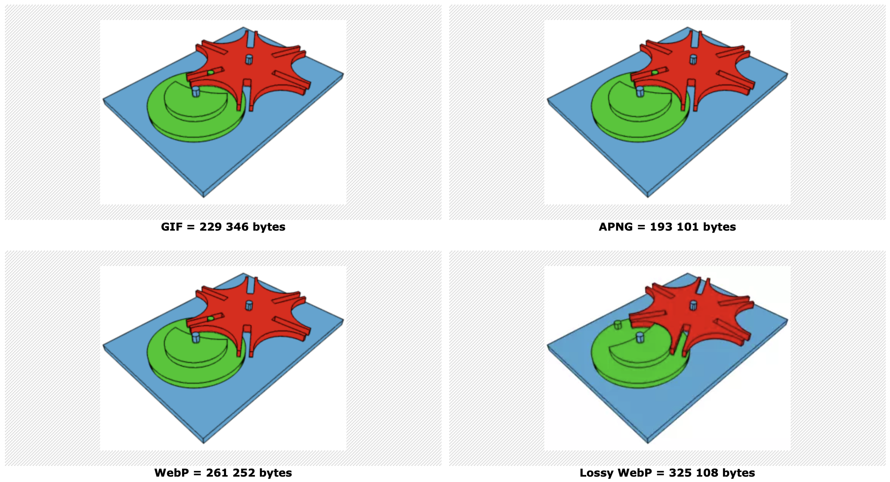

# 创意周刊（第 43 期）：古代人与面包、啤酒和其他碳水化合物

创意周刊是基于每周阅读的新闻、时事、图片和技术等内容的分享期刊。

## 封面图

## 本周话题：

## 科技动态

### 1. 

## 文章

### 1. 

## 工具

### 1. [argyleink/open-props](https://github.com/argyleink/open-props)

CSS 自定义属性库，可帮助加速自适应和一致的设计。

### 2. [liabru/matter-js](https://brm.io/matter-js/)

一个用于网页的 2D 物理引擎。

### 3. [GIF vs APNG vs WebP](http://littlesvr.ca/apng/gif_apng_webp.html)

对同样无损的 GIF、APNG 和 WebP 动态图片，APNG 的尺寸最小。

## 创意

### 1. 
## 图片

### 1. 
## 文摘

### 1. 